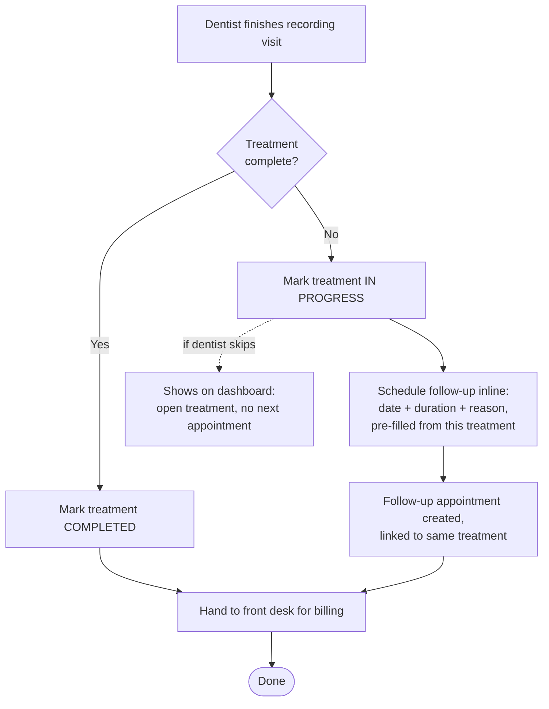
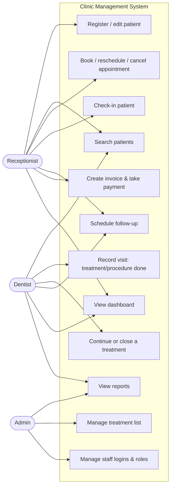
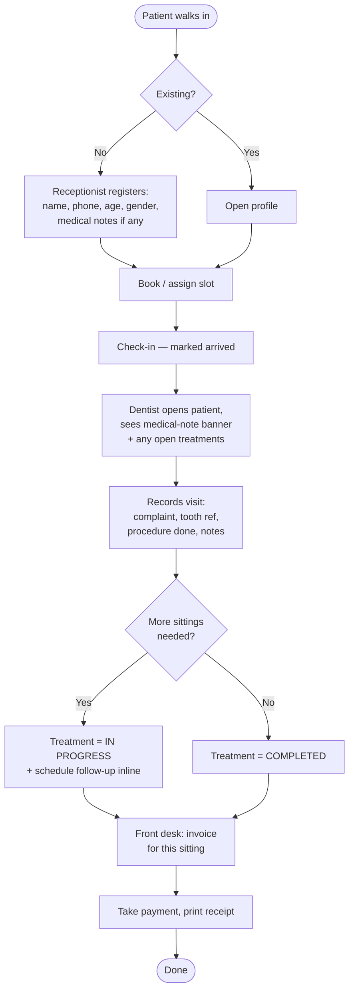
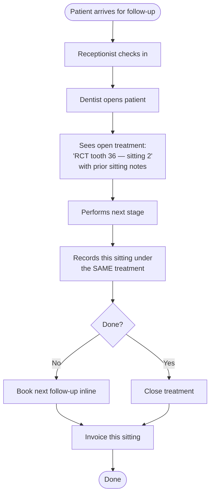
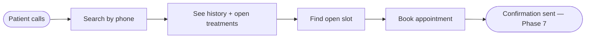
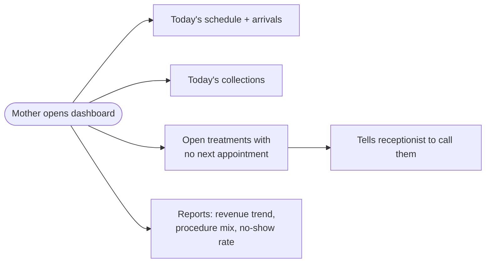
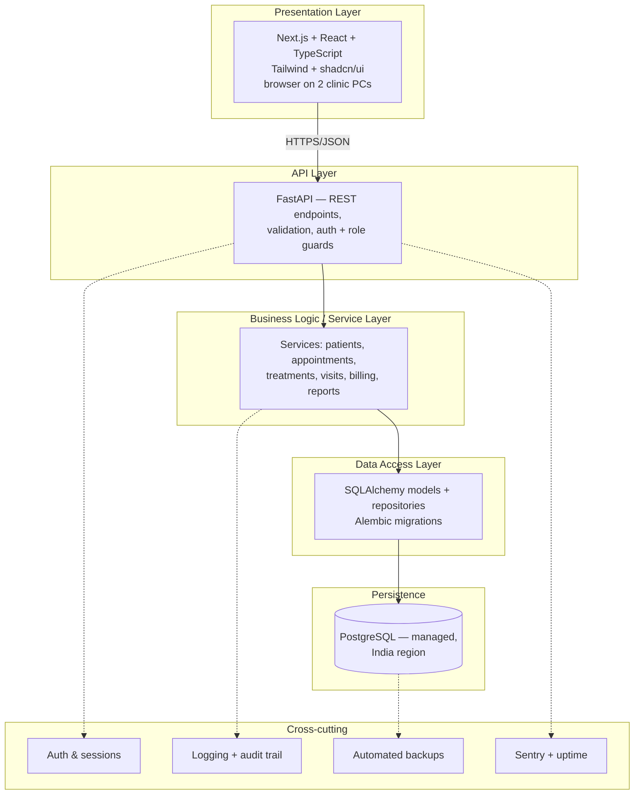
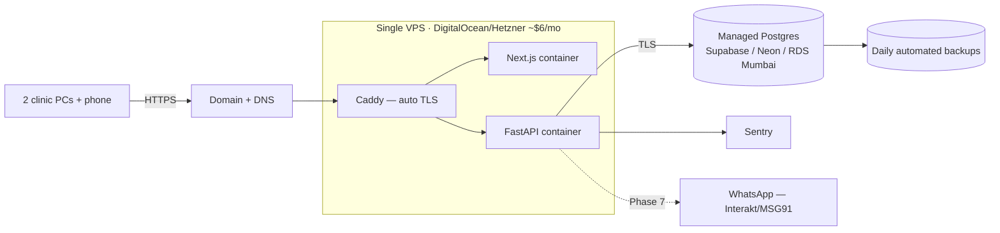
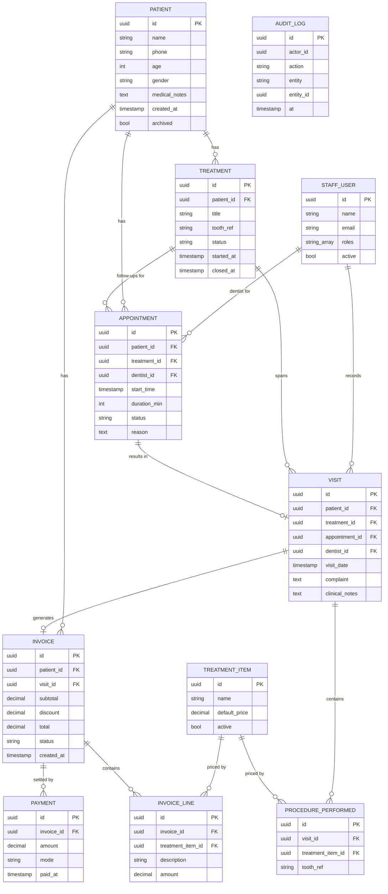

# Dental Clinic Management System — Build Plan & Architecture

> A production-grade clinic management web app for a single small dental clinic in Davangere. 2 computers, 2–3 users, staff-only (no patient logins). Built on weekends, deployed from day one, running in parallel with a bought vendor until proven.
>
> **Use this as `CLAUDE.md` at the project root.** Build one step at a time, commit after each.

---

## 1. Scope

**In scope:**
- Patient records (profile + history)
- Appointments & scheduling
- Visits — recording the treatment/procedure performed
- **Follow-up scheduling** — booking the next sitting from within the visit
- Billing & payments
- Dashboard & basic reports
- Staff auth with 3 roles

**Explicitly OUT of scope** (decided, not deferred — do not build these):
- ~~Prescriptions~~ · ~~Treatment plans (quoted/estimated)~~ · ~~Consent forms~~ · ~~Dental charting / odontogram~~ · ~~Inventory~~ · ~~Lab work tracking~~ · ~~Patient portal / patient logins~~ · ~~Insurance claims~~

**Rationale:** small tier-2 city clinic, cash-pay, two staff. The above are where big vendors spend their complexity budget and where this project would die before shipping.

### Two scope notes worth reading

**1. Billing needs prices from somewhere.** The rate card was cut, but billing can't invent prices. Two options:
- **(a) Free-text line items** — receptionist types treatment name + amount on every invoice. Zero build cost, but repetitive, typo-prone, and it makes "revenue by procedure" reporting impossible (every row is a different spelling of "Cleaning").
- **(b) A tiny treatment list** — one flat table in Settings: name + default price. ~1 evening of work. Invoice lines pick from it; price stays editable per invoice.

**Recommendation: (b).** It's not the "rate card module" you cut — it's a dropdown with a price. One evening, and it's what makes your reports mean anything. *If you disagree, (a) is genuinely fine and you can add (b) later.*

**2. Medical history / allergies — keep the field, drop the ceremony.** You're right that it's an exception, not the norm. But "exception" is exactly why it matters: the one diabetic or blood-thinner patient is the one where it counts. So: **one free-text `medical_notes` field on the patient profile that renders as a banner if non-empty.** No structured allergy tables, no drug-interaction logic. Costs nearly nothing, covers the exception.

---

## 2. Roles

Three roles. Staff-only — no patient access.

| Role | Who | Access |
|---|---|---|
| **Receptionist** | Front-desk staff | Register/edit patients, book/reschedule/cancel appointments, check-in, **schedule follow-ups**, create invoices, take payments, view today's dashboard |
| **Dentist** | Your mother | Everything Receptionist can do, **plus** record visits/treatments, close or continue a treatment, **schedule follow-ups from the visit screen**, view reports |
| **Admin** | Your mother (same login) | Everything, **plus** manage staff logins, edit treatment list, clinic settings |

> **Important:** your mother is one person who is both Dentist and Admin. Don't make her log in twice. Model permissions as a **set** — let one user hold `["dentist", "admin"]`. A single `role` string column forces an awkward `"dentist_admin"` hack later. Use a `roles` array from the start.

---

## 3. The clinical model — treatments, visits, follow-ups

This is the core of the app and the part most worth getting right.

**The reality:** a patient comes in with a complaint. The dentist does a procedure. It may finish today, or need 2–4 more sittings across weeks. RCT is the classic case — clean and shape at visit 1 with a temporary filling, permanent seal and crown at a follow-up visit. The number of sittings depends on infection severity, tooth anatomy, and how the tooth responds — **so the dentist frequently does not know the visit count upfront.**

**What this means:** you cannot model a visit as a standalone event. You need a thread.

```
PATIENT
   └── TREATMENT (a case: "RCT on tooth 36", status: in_progress)
          ├── VISIT 1  (2 Aug  — access opening, temp filling)   → invoice
          ├── VISIT 2  (9 Aug  — cleaning & shaping)             → invoice
          └── VISIT 3  (20 Aug — obturation + crown)             → invoice, treatment closed
```

**A `TREATMENT` is NOT a treatment plan.** No cost estimate, no quote, no acceptance tracking, no multi-option presentation. It is only: *what is being done, to which tooth, is it still ongoing.* It exists so that:
- The dentist opens a patient and instantly sees **"RCT tooth 36 — in progress, 2 sittings done"** instead of three disconnected notes.
- Follow-ups attach to something meaningful.
- The dashboard can show **"open treatments with no next appointment booked"** — the single most valuable report in the app, because that's revenue walking out the door.

**Simple cases stay simple:** a one-visit cleaning is a Treatment with exactly one Visit, auto-created and auto-closed. The receptionist never has to think about the word "treatment" — the UI just says "Cleaning — done."

### Follow-up scheduling (your requirement)

The follow-up must be bookable **from inside the visit screen, in the same flow** — not as a separate "now go to the calendar" trip. That's the difference between it getting used and not.



> Both the dentist **and** the receptionist can schedule follow-ups — the dentist inline from the visit, the receptionist from the patient profile or calendar.

---

## 4. Use case diagram



---

## 5. User journeys

### 5.1 New walk-in → treatment started → follow-up booked (the main path)



### 5.2 Returning patient — follow-up sitting



### 5.3 Phone booking



### 5.4 Owner reviewing the practice



---

## 6. Screens / views

**Auth & shell**
- `Login`
- `App shell` — sidebar, role-aware nav, clinic name

**Receptionist + Dentist**
- `Dashboard` — today's appointments w/ status, waiting list, today's collections, **open treatments with no follow-up booked**
- `Appointment calendar` — day view (default) + week view, drag-drop reschedule, colour by status (booked / arrived / done / cancelled / no-show)
- `New / Edit appointment` — patient picker, date/time, duration, reason, optional link to existing treatment
- `Patient list` — search by name/phone
- `Patient profile` — **Overview** (demographics + medical-notes banner) · **Treatments** (open + past, each expandable to its visits) · **Billing history**
- `New / Edit patient`
- `Visit record` (dentist) — complaint, tooth ref, procedure(s) done, notes, treatment status toggle, **inline follow-up scheduler**
- `Invoice` — line items, discount, total, payment mode, printable receipt

**Admin**
- `Reports` — collections over time, procedure mix, no-show rate, new vs returning
- `Treatment list` — name + default price (see §1 note)
- `Staff & roles`
- `Clinic settings` — name, logo, working hours, slot duration

---

## 7. Architecture layers



### Deployment topology



---

## 8. Tech stack

| Layer | Choice | Why |
|---|---|---|
| **Frontend** | Next.js + TypeScript + Tailwind + shadcn/ui | You know React. shadcn gives tables/dialogs/forms free. TS catches bugs before your mother does. |
| **Backend** | FastAPI + Pydantic | Your strength. Auto OpenAPI docs. |
| **Database** | PostgreSQL (managed) | Relational data — exactly what SQL is for. Managed = backups/patching handled. |
| **ORM / migrations** | SQLAlchemy + Alembic | Migrations = evolving schema **without losing real patient data**. Key production skill. |
| **Auth** | Managed — Supabase Auth or Clerk | **Do not roll your own** on a system holding health data. |
| **Container** | Docker + Docker Compose | Reproducible deploys. Most transferable ops skill here. |
| **Proxy / TLS** | Caddy | Automatic HTTPS, near-zero config. |
| **Hosting** | Single VPS (DigitalOcean/Hetzner/Lightsail) | The "real ops" path — teaches the most. *Escape hatch: Render/Railway if weekends get tight.* |
| **Monitoring** | Sentry + UptimeRobot | Know it broke before your mother calls. |
| **CI/CD** | GitHub Actions | Tests + deploy on push. Portfolio-relevant. |
| **Messaging (Ph 7)** | WhatsApp Cloud API / Interakt / MSG91 | WhatsApp is *the* channel for Indian clinics. |

> **Starting shortcut:** Supabase = Postgres + Auth in one, free tier. Removes two setup problems at once. Migrate to RDS Mumbai later if strict data residency becomes a hard requirement.

---

## 9. Data model (ERD)



**Key relationships:**
- `TREATMENT` threads `VISIT`s together — the heart of the model.
- `APPOINTMENT.treatment_id` is **nullable** — a first-time booking has no treatment yet; a follow-up does.
- `VISIT.appointment_id` is **nullable** — walk-ins happen.
- `INVOICE` is per-**visit**, not per-treatment — patients pay per sitting.
- `PATIENT.archived` — soft delete only. Never hard-delete patient records (retention ≥3 years, ideally 7 for medico-legal).

---

## 10. Build roadmap — step by step, commit after each

Each step is a **commit-sized, deployable slice**. Push after each. Never skip ahead; never let more than one step be half-done.

### PHASE 0 — Foundation (get deploying before building)

| Step | Deliverable | Commit message |
|---|---|---|
| 0.1 | Repo init, README, `.gitignore`, `CLAUDE.md` | `chore: initialise repo and project docs` |
| 0.2 | FastAPI app + `/health` endpoint | `feat: add FastAPI backend with health check` |
| 0.3 | Next.js + TS + Tailwind + shadcn shell | `feat: scaffold Next.js frontend` |
| 0.4 | Docker Compose (fe + be + Caddy) running locally | `chore: containerise with docker compose` |
| 0.5 | Managed Postgres connected, SQLAlchemy + Alembic, first migration | `feat: connect Postgres with Alembic migrations` |
| 0.6 | **Deploy to VPS, domain + HTTPS live** | `ci: deploy to production VPS with TLS` |
| 0.7 | GitHub Actions: test + deploy on push to main | `ci: add GitHub Actions pipeline` |

> **Milestone:** a live HTTPS URL showing a blank shell. *The scariest part is done, in week 1.*

### PHASE 1 — Auth & roles

| Step | Deliverable | Commit |
|---|---|---|
| 1.1 | Managed auth wired (Supabase/Clerk), login page | `feat: add authentication` |
| 1.2 | `staff_user` model with `roles` array, seed admin | `feat: add staff users and roles` |
| 1.3 | Role guards on API + role-aware nav | `feat: enforce role-based access control` |
| 1.4 | `audit_log` table + write on mutations | `feat: add audit logging` |

> **Milestone:** your mother can log in on the real URL.

### PHASE 2 — Patients

| Step | Deliverable | Commit |
|---|---|---|
| 2.1 | `patient` model + migration | `feat: add patient model` |
| 2.2 | Patient CRUD API + tests | `feat: add patient CRUD endpoints` |
| 2.3 | Patient list + search by name/phone | `feat: add patient list and search` |
| 2.4 | Patient profile page + medical-notes banner | `feat: add patient profile view` |

> **Milestone:** real patient records can be entered. **Start entering real data here** — it makes everything after this real.

### PHASE 3 — Appointments

| Step | Deliverable | Commit |
|---|---|---|
| 3.1 | `appointment` model + migration | `feat: add appointment model` |
| 3.2 | Booking API + **double-booking prevention at service/DB layer** | `feat: add appointment booking with conflict checks` |
| 3.3 | Day-view calendar | `feat: add day view calendar` |
| 3.4 | Week view + drag-drop reschedule | `feat: add week view and rescheduling` |
| 3.5 | Status flow: booked → arrived → done / cancelled / no-show | `feat: add appointment status workflow` |
| 3.6 | Dashboard v1: today's schedule + arrivals | `feat: add dashboard with today's schedule` |

> **Milestone:** the front desk could run on this. **Begin parallel run with the vendor.**

### PHASE 4 — Treatments, visits & follow-ups (the core)

| Step | Deliverable | Commit |
|---|---|---|
| 4.1 | `treatment_item` list + Settings CRUD | `feat: add treatment catalogue` |
| 4.2 | `treatment` + `visit` + `procedure_performed` models | `feat: add treatment and visit models` |
| 4.3 | Visit recording API (auto-creates treatment if new) | `feat: add visit recording endpoints` |
| 4.4 | Visit record screen for dentist | `feat: add visit record screen` |
| 4.5 | Treatment lifecycle: in_progress / completed | `feat: add treatment lifecycle` |
| 4.6 | **Inline follow-up scheduler from visit screen** | `feat: schedule follow-ups from visit record` |
| 4.7 | Patient profile → Treatments tab, visits nested | `feat: show treatment history on patient profile` |
| 4.8 | Dashboard: **open treatments with no next appointment** | `feat: flag open treatments missing follow-ups` |

> **Milestone:** the clinical loop is complete. This is the phase that makes it *actually dental software*.

### PHASE 5 — Billing

| Step | Deliverable | Commit |
|---|---|---|
| 5.1 | `invoice` + `invoice_line` + `payment` models | `feat: add billing models` |
| 5.2 | Invoice generation from visit procedures | `feat: generate invoices from visits` |
| 5.3 | Payment capture + outstanding balance | `feat: add payment capture` |
| 5.4 | Printable receipt on clinic letterhead | `feat: add printable receipts` |
| 5.5 | Dashboard: today's collections | `feat: show daily collections` |

> **Milestone:** full front-desk-to-payment loop. **This is when you can seriously consider cutting the vendor.**

### PHASE 6 — Reports & hardening

| Step | Deliverable | Commit |
|---|---|---|
| 6.1 | Reports: revenue trend, procedure mix, no-show rate | `feat: add practice reports` |
| 6.2 | Sentry + UptimeRobot | `chore: add error tracking and uptime monitoring` |
| 6.3 | **Backup restore drill + documented runbook** | `docs: add backup and restore runbook` |
| 6.4 | Staging environment | `chore: add staging environment` |

> **Milestone:** production-grade. **6.3 is not optional** — see §11.

### PHASE 7 — Optional upgrades (only once live and stable)
- WhatsApp appointment reminders + follow-up nudges (highest real value)
- Recall reminders for periodic check-ups
- Document/X-ray uploads (needs object storage)

---

## 11. Non-negotiables

**Security**
- HTTPS everywhere. Managed auth. No self-rolled password handling.
- **Role checks on the API**, not just hidden UI buttons. A hidden button is not security.
- No patient identifiers in URL query strings.
- `audit_log` of who accessed/changed what.

**Patient data (DPDP Act, India)**
- Health data = sensitive personal data. Treat it seriously.
- **Soft-delete only.** Retention ≥3 years, ideally 7 for medico-legal protection.
- Have a data-residency story (India-region Postgres if you want to be clean).

**Reliability**
- **Backups you have actually test-restored.** Untested backups are decoration. If you do one thing in this whole project, do this. Restore to a scratch DB, confirm the rows are there, then write down how — because you'll do it in a panic someday.
- **Double-booking prevention** at the DB/service layer — two PCs *will* race.
- **Shaky internet is real in tier-2 clinics.** A cloud-only app is dead when the line drops. At minimum, graceful error states. This is why the vendor parallel run matters.

**Operational**
- Alembic migrations always. Never `DROP` on live data.
- Never test on live patient data — that's what staging is for.

---

## 12. Running cost

| Item | ~Monthly |
|---|---|
| VPS | $5–12 |
| Managed Postgres | $0 free tier → $15 |
| Domain | ~₹1,000/yr |
| Sentry / UptimeRobot | free |
| **Total** | **~₹500–1,200/mo** |

Roughly what BestoSys costs. **The build saves no money.** Its value is the learning and the "in production at a real clinic" line. That's a good reason — just be honest that it's the reason.

---

*Build the spine. Deploy embarrassingly early. Let it earn its way into the clinic.*
