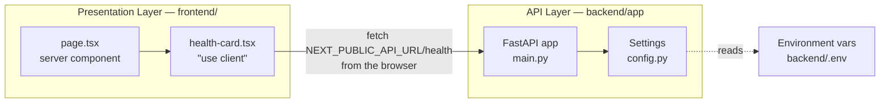
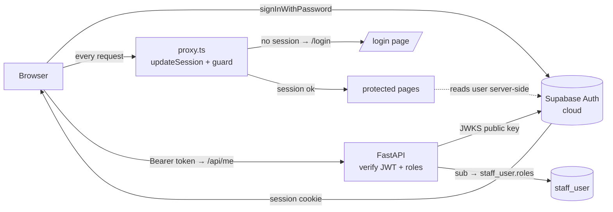
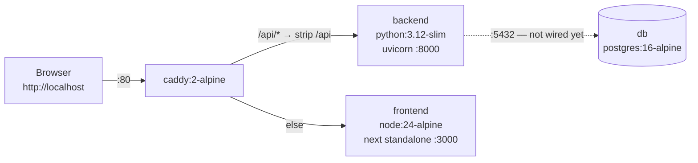

# ARCHITECTURE

**Honest to the code as of step 4.1 (Phase 4 begun).** This describes what is built, not what
is planned.
The target architecture lives in [BUILD_PLAN.md](BUILD_PLAN.md); this file catches up to it
one step at a time.

## The layers, today

Two layers: a Next.js presentation layer and a FastAPI API layer. They are separate origins
that talk over HTTP/JSON. The API answers from memory — there is no database.



Of the target layers — presentation, API, service, data access, persistence — the
presentation and API layers exist. There is no service layer, no data access layer, and no
persistence.

## How a request flows

`GET /health` is the only route, and the one page calls it.

1. The browser requests `/`. Next.js server-renders `page.tsx`, which contains the clinic name
   and the `HealthCard`. The card's initial HTML shows its **loading** state.
2. In the browser, `HealthCard`'s `useEffect` fires and calls
   `${NEXT_PUBLIC_API_URL}/health` — a **cross-origin** request from `localhost:3000` to
   `localhost:8000`.
3. **uvicorn** accepts it and hands it to the ASGI app.
4. **CORSMiddleware** checks the `Origin` against `settings.cors_origins_list` (the
   `CORS_ORIGINS` env var, split on commas) and adds `Access-Control-Allow-Origin`.
5. The **`health()` handler** in [main.py](../backend/app/main.py) returns
   `{"status": "ok", "environment": settings.environment}`.
6. The card re-renders into **ok** (green, showing status + environment) or, if the fetch
   throws, **error** (red). The error state is a real state — the page does not crash when the
   backend is down.

No database is touched by `/health`, and the **backend** checks no auth (backend auth is 1.3).
Auth is enforced on the **frontend** by `proxy.ts` before protected pages render — see the
Authentication section below.

**Under Docker Compose the shape differs slightly:** the browser talks only to Caddy on
`http://localhost` and calls `http://localhost/api/health`. That is the **same origin** as the
page, so CORS is not exercised at all; Caddy strips `/api` and forwards to `backend:8000`. The
two-origin, CORS-exercising path above is the by-hand dev mode (`next dev` on :3000 calling
uvicorn on :8000). Both are supported; see the topology section.

## Why the health call is client-side

`HealthCard` is a `"use client"` component and the fetch runs in the **browser**, deliberately.

The alternative — fetching from a server component — would run inside the Next.js container in
production, where the backend is reachable as `http://backend:8000` (a Docker service name).
That URL is meaningless to a browser on a clinic PC. Any config that worked server-side would
break client-side, and the failure surfaces as an opaque network/CORS error.

So: `NEXT_PUBLIC_API_URL` must always be a URL **the browser can reach**, and the call must be
client-side to match. `NEXT_PUBLIC_*` values are inlined at **build** time, not runtime — step
0.4's Dockerfile therefore has to pass it as a build arg.

## Authentication & authorization (Supabase — steps 1.1 & 1.3)

Two layers work together:
- **Frontend (1.1):** signs the user in against Supabase, keeps the session in cookies, and
  guards routes (signed-in vs not) in `proxy.ts`.
- **Backend (1.3):** verifies the Supabase **JWT** on protected endpoints and enforces **roles**
  from our database. This is the real security boundary — "role checks on the API, not just
  hidden UI." The frontend's role-aware nav is only a convenience on top.



### API auth chain (backend, `app/auth.py`)

The endpoint dependencies, from raw request to an authorized staff member:

1. **`get_current_claims`** — reads the `Authorization: Bearer <token>` header, fetches the
   ES256 **public key** from Supabase's JWKS endpoint (`PyJWKClient`, cached), and
   `jwt.decode`s the token verifying signature + `audience="authenticated"` + issuer + expiry.
   Any failure → **401**. *The backend never holds a secret — tokens are asymmetric (ES256).*
2. **`get_current_staff`** — takes `claims["sub"]` (the Supabase UUID) and loads
   `staff_user` by primary key. No row, or `active = false` → **403**. A valid Supabase token
   means *authenticated*, not *authorized here*.
3. **`require_role(*roles)`** — a dependency factory; **403** unless the staff row holds one of
   the given roles. Phase 2 endpoints will decorate with `Depends(require_role("dentist", …))`.

`GET /me` uses (2) and returns the staff member + roles (the frontend nav's source of truth).
`GET /admin/ping` uses `require_role("admin")` and exists to demonstrate the 403 path.

**Roles come from our DB, not the token.** The token's `role` claim is the Postgres role
(`"authenticated"`); app roles live in `staff_user.roles`. So changing a user's roles or
deactivating them takes effect on the next request — no token reissue needed.

- **`lib/supabase/client.ts`** — browser client (`createBrowserClient`). Used by the login form
  and the sign-out button.
- **`lib/supabase/server.ts`** — server client (`createServerClient`) bound to Next's
  `cookies()`. Used by server components (e.g. `page.tsx` reads the signed-in user). Its cookie
  `setAll` is wrapped in try/catch because a Server Component may read but not write cookies.
- **`lib/supabase/middleware.ts` → `updateSession()`** — the session refresh + route guard,
  called from `proxy.ts` on every matched request. It calls `getUser()` (which refreshes an
  expired token), then: no user and not on `/login` → redirect to `/login`; signed-in user on
  `/login` → redirect to `/`. Refreshed cookies are copied onto redirects so the browser gets
  the fresh session.
- **`proxy.ts`** — the root request interceptor. *Next 16 renamed the `middleware` file
  convention to `proxy`; the API is identical.* Its `matcher` skips `_next/*` and static assets.

**Why the token can't refresh in a Server Component:** server components can read cookies but
not write them, so a rotated token couldn't be persisted. The proxy runs before the render and
*can* write cookies — that's why session refresh lives there. This is the standard
`@supabase/ssr` App Router pattern.

**No roles yet.** There is no `staff_user` table and no role concept in 1.1 — any authenticated
Supabase user reaches the app. Roles (`staff_user` + `roles` array) come in 1.2, and API-side
role guards + JWT verification in 1.3. Until then, `/api/*` is unauthenticated.

The two `NEXT_PUBLIC_SUPABASE_*` values are inlined at **build** time (like
`NEXT_PUBLIC_API_URL`), so they are build args in the Dockerfile and compose file, sourced from
the gitignored root `.env`.

## Configuration

All config comes from environment variables, read once at import time by the `Settings` class
in [config.py](../backend/app/config.py) and exposed as a module-level `settings` object.
Nothing is hardcoded — local and production will differ by config only.

| Setting | Env var | Side | Status |
|---|---|---|---|
| `environment` | `ENVIRONMENT` | backend | Used — returned by `/health`. |
| `cors_origins` | `CORS_ORIGINS` | backend | Used — feeds the CORS middleware. Comma-separated. Defaults to `http://localhost:3000`, which is where `next dev` serves. |
| `database_url` | `DATABASE_URL` | backend | Used — feeds the SQLAlchemy engine (`app/db.py`) and, separately, Alembic (`alembic/env.py`). |
| — | `NEXT_PUBLIC_API_URL` | frontend | Used — the backend base URL the browser calls. Inlined at **build** time. `http://localhost/api` under Docker (through Caddy); `http://localhost:8000` for by-hand dev. |
| — | `NEXT_PUBLIC_SUPABASE_URL` | frontend | Used — Supabase project base URL (`https://<ref>.supabase.co`, not the `/rest/v1` endpoint). Inlined at **build** time. |
| — | `NEXT_PUBLIC_SUPABASE_PUBLISHABLE_KEY` | frontend | Used — Supabase publishable (anon) key, safe in the browser. Inlined at **build** time. For Docker, both Supabase vars come from the gitignored root `.env`. |

`cors_origins` is typed as a `str` and split on commas by the `cors_origins_list` property
rather than being typed as `list[str]`, because pydantic-settings parses list-typed fields as
JSON — which would reject the plain `http://localhost:3000` form in a `.env` file.

## Data access layer

As of 6.11 there are **sixteen models** — `staff_user`, `audit_log`, `patient`, `appointment`,
`treatment_item`, `treatment`, `visit`, `procedure_performed`, `clinic_settings`, `invoice`,
`invoice_line`, `payment`, `patient_file`, `lab`, `lab_case`, `tooth_condition` — and **ten
`app/services/` modules** (`audit`, `appointments`, `visits`, `treatments`, `clinic`, `billing`,
`storage`, `reports`, `lab`, `chart`).
The billing loop is complete (5.2–5.5); 5.6 added patient file uploads; 6.1 added practice reports;
6.6 added lab management; 6.7 split the catalogue by `kind` and put a consultation fee on the
dentist; 6.8 added the workflow rules that keep those tables consistent with each other; 6.10 made
the visit carry the clinic's whole OPD card; 6.11 added the dental chart.

- **`app/db.py`** — the SQLAlchemy `engine` (a connection pool to Postgres, `pool_pre_ping`
  on so dead pooled connections are replaced not reused), `SessionLocal` (a session =
  one transaction), and `get_db` (a FastAPI dependency that yields a session and always
  closes it).
- **`app/models/__init__.py`** — `Base`, the `DeclarativeBase` every model inherits from. It
  **imports each model** at the bottom so they register on `Base.metadata` by the time Alembic's
  `env.py` runs (otherwise `--autogenerate` sees an empty schema).
- **`app/models/staff_user.py`** — `StaffUser`. Its primary key **is the Supabase Auth user's
  UUID** (the JWT `sub`) — one identity, no separate linking column. `roles` is a Postgres
  `ARRAY(Text)` holding the set of roles (e.g. `["dentist","admin"]`), never a single string.
  `active` soft-disables a login; `email` mirrors the Supabase login email (unique).

- **`app/models/audit_log.py`** — `AuditLog`, the append-only "who changed what" trail
  (BUILD_PLAN §11). `id` is server-generated (`gen_random_uuid()`); `actor_id` is the acting
  `staff_user` (**nullable, no FK** — null = a system/seed action, and the trail must outlive the
  entities it references); `action`/`entity`/`entity_id` say what happened to which row;
  `details` is nullable `JSONB` for context (a small, deliberate extension beyond the ERD). Rows
  are only ever inserted.
- **`app/services/audit.py` → `record_audit(db, *, actor_id, action, entity, entity_id, details)`**
  — the single way anything writes an audit row. It inserts into the **caller's** session and
  flushes but does **not** commit, so the audit entry and the change it records commit atomically
  in one transaction. Phase 2 mutation endpoints call it with `actor_id=current_staff.id`; the
  seed calls it with `actor_id=None`.
- **`app/models/patient.py`** — `Patient`, the first patient-data model (Phase 2). Soft-delete
  only via `archived` (never hard-deleted — medico-legal retention). Stores `date_of_birth`
  (nullable) and computes `age` via a read-only `@property` rather than storing a stale int.
  `medical_notes` is one free-text field (renders as a banner later). `created_at`/`updated_at`
  timestamps. No endpoints yet — CRUD is 2.2.
- **`app/models/appointment.py`** — `Appointment`, a booked calendar slot (Phase 3, step 3.1).
  **The schema's first table with foreign keys:** `patient_id → patient.id` (NOT NULL — always
  belongs to a patient) and `dentist_id → staff_user.id` (nullable — a slot may be unassigned).
  `treatment_id → treatment.id` is nullable and, **as of 4.2, a real FK** (it was a bare UUID from
  3.1 until the `treatment` table existed — a first booking has no treatment; a follow-up does).
  `start_time` (timestamptz), `duration_min` (default 30), `status` (default
  `booked` — the transition *workflow* is 3.5, this step is only the column), `reason` (free
  text), `created_at`/`updated_at`. No `relationship()` navigations yet. Endpoints arrived in 3.2
  (see the booking API below).
- **`app/services/appointments.py`** — the **second `services/` module** (3.2). `find_conflicts()`
  is the app-side half of double-booking prevention: it returns non-cancelled appointments for the
  same dentist whose half-open time span `[start, start+duration)` overlaps a proposed slot. It's a
  UX layer (a friendly 409) on top of the real guarantee, which is the DB constraint — the two use
  the identical UTC `tsrange` overlap expression so they always agree. Returns `[]` for an
  unassigned (`dentist_id is None`) slot.
- **`app/models/treatment_item.py`** — `TreatmentItem`, the flat priced catalogue
  (Phase 4, step 4.1): `name`, `default_price`, `active`, timestamps. **The
  project's first money column** — `default_price` is `Numeric(10, 2)` in Postgres and `Decimal` in
  Python, **never a float**: binary floating point cannot represent decimal currency exactly, and a
  rounding error in an invoice is a real bug. Phase 5's invoice/payment amounts follow the same
  rule. Items are **deactivated, never deleted** (`active`), so past visits/invoices that reference
  one still resolve. **As of 6.7 it carries a `kind`** (`treatment` | `medicine`) and the unique is
  composite **`(kind, name)`**, not bare `name` — the same word may name both a procedure and a
  drug. See "Pricing" below for why the consultation fee is deliberately *not* a third kind.
- **`app/models/treatment.py`** — `Treatment`, **the heart of the clinical model** (Phase 4, step
  4.2). Dental work is multi-visit — an RCT is 2–4 sittings and the dentist often doesn't know the
  count upfront — so a visit can't be a standalone event; it needs a thread to hang off. A treatment
  is `patient_id` (FK, NOT NULL) + `title` ("RCT tooth 36") + nullable `tooth_ref` + `status`
  (`in_progress` / `completed`, default `in_progress`) + `started_at` / nullable `closed_at`.
  **It is NOT a treatment plan** — no estimates, no quotes, no acceptance tracking (out of scope);
  it answers only *what, which tooth, still ongoing?*. `status` is plain Text with no CHECK/enum,
  like `appointment.status` — the transitions are enforced in the API in 4.5.
- **`app/models/visit.py`** — `Visit`, one sitting. `treatment_id → treatment.id` is **NOT NULL**:
  every visit hangs off a treatment, which is what makes the thread real. Single-visit work doesn't
  escape it — the visit API (4.3) auto-creates and auto-closes a treatment for a one-off cleaning,
  so the user never sees the concept. `patient_id` (FK, NOT NULL) is **deliberately denormalised**
  from the treatment: nearly every clinical read is "this patient's visits", and carrying it
  directly avoids a join on the hottest path. `appointment_id` is **nullable** (walk-ins happen),
  as is `dentist_id`. Plus `visit_date`, `complaint`, `clinical_notes`.
- **`app/models/procedure_performed.py`** — `ProcedurePerformed`, the join row between a visit and
  the 4.1 catalogue: `visit_id` (FK) + `treatment_item_id` (FK) + nullable per-procedure
  `tooth_ref`. One visit can contain several procedures, hence a table rather than a column. This FK
  is exactly why treatment items **deactivate rather than delete** — a retired item must still
  resolve or an old visit becomes unreadable. **No price column, deliberately:** whether a procedure
  should snapshot the price at the time it was performed is a question **5.2** must answer when
  invoices arrive; invoices are the record of what was charged.

No `relationship()` navigations on any of the three — plain FK columns until a step needs ORM
navigation (addable later without a migration). Endpoints arrived in 4.3 (see the visit recording
API below).
- **`app/models/clinic_settings.py`** — `ClinicSettings`, a **singleton** (Phase 4 wrap, 4.9): one
  row pinned to `id = 1` by a CHECK, seeded by the migration, holding the clinic's `open_hour` /
  `close_hour` / `slot_minutes` / `timezone`. These were hardcoded through Phase 3–4; now the calendar
  grid, the visit form's follow-up duration, and — crucially — the appointment day/range bounds read
  them. **5.4 added identity** — `clinic_name` (NOT NULL, default 'Dental Clinic'), `address`, `phone`
  (nullable) — printed on the receipt header (migration `e8dbf0db4dec`, the 11th). `GET /clinic-settings`
  is any active staff, `PATCH` is admin-only + audited.
- **`app/services/clinic.py`** — the **fifth `services/` module** (4.9). `clinic_day_bounds(day, tz)`
  returns the UTC window of a clinic-local calendar day using stdlib `zoneinfo`. This is the timezone
  fix: `list_appointments` bounds "a day" in the clinic zone, so an IST-evening appointment (whose UTC
  date is the day before) lands on the correct clinic day. The overlap constraint and `find_conflicts`
  are untouched — they compare instants, which are zone-independent.
- **`app/models/invoice.py`** — `Invoice`, the billing models' head (Phase 5, step 5.1). **One
  invoice per visit** (ERD §9): `visit_id` is a NOT NULL FK with a **UNIQUE** constraint, so a second
  invoice for the same visit is impossible at the DB. `patient_id` is denormalised from the visit
  (billing-history-by-patient is a hot read). `subtotal` / `discount` / `total` are `Numeric(10,2)`
  (the money-is-Decimal-never-float rule, 4.1); `status` is free-text (`unpaid` / `partially_paid` /
  `paid`, default `unpaid`) with **no DB enum** — transitions get enforced in the service layer at
  5.3, matching the appointment/treatment status precedent. The migration hand-adds two CHECKs:
  amounts non-negative, and `discount <= subtotal`.
- **`app/models/invoice_line.py`** — `InvoiceLine`, one row per charged procedure. It **snapshots**
  what was charged: `description` (Text) and `amount` (`Numeric(10,2)`) are **frozen** at generation
  time (5.2), copied from the catalogue rather than read live — so re-reading an old invoice shows the
  price actually charged then, not today's. This is the deliberate answer to the price-snapshot
  question deferred from 4.2. `treatment_item_id` is therefore a **nullable** FK, kept only as a
  reporting link ("revenue by procedure"). A CHECK enforces `amount >= 0`.
- **`app/models/payment.py`** — `Payment`, one row per payment against an invoice. An invoice may be
  settled by **several** payments (part-payments), so this is a table, not a column on `invoice`;
  summing them versus `total` drives status + outstanding balance (5.3). `amount` is `Numeric(10,2)`
  (CHECK `>= 0`); `mode` (cash / card / upi) is free-text, pinned via a Pydantic `Literal` when the
  payment API lands (5.3). No `relationship()` navigations on any of the three — house style.
- **`app/services/billing.py`** — the **sixth `services/` module** (5.2). `generate_invoice()` turns
  a recorded visit into a priced invoice: it copies each of the visit's `procedure_performed` rows
  into a **frozen** `invoice_line` (the catalogue item's current `name` + `default_price` copied in —
  the snapshot rule), appends any biller-typed custom lines, sums the subtotal, applies a discount,
  and creates the invoice + lines. It pre-checks the one-per-visit rule (the `visit_id` UNIQUE is the
  real guarantee) and raises **domain exceptions** — `VisitNotFound`, `InvoiceAlreadyExists`,
  `NothingToInvoice`, `DiscountExceedsSubtotal` — which the router maps to 404 / 409 / 422 / 422. It
  `flush()`es but never commits (the caller owns the transaction — the 4.3 pattern). Reuses the same
  procedure↔catalogue join as `routers/visits._load_procedures`. **Payment capture (5.3) extends this
  module**, not a new one: `record_payment()` adds a `Payment` and recomputes the invoice status;
  `_recompute_status()` **derives** `invoice.status` from `sum(payments)` vs `total`
  (`unpaid`/`partially_paid`/`paid`) — never client-set, so it can't drift; `invoice_balances()`
  returns `(amount_paid, outstanding)` where `amount_paid` is the true sum (may exceed total, as
  **overpayment is allowed**) and `outstanding` floors at 0. Both balance figures are
  `.quantize(Decimal("0.01"))` so a floored or coalesced-0 value serialises as `"0.00"` like the
  `Numeric(10,2)` columns, not `"0"`.
- **`app/models/patient_file.py`** — `PatientFile` (5.6), an uploaded X-ray/photo/document. `patient_id`
  FK NOT NULL (indexed), nullable `visit_id` (a file may be tied to a sitting or not) + `uploaded_by`.
  Metadata only — `kind`, `original_filename`, `content_type`, `size_bytes`, `caption`, and an opaque
  `storage_key`; the **bytes live on disk, never in the DB**. Soft-delete via `archived` (medico-legal
  retention). This is opaque file storage, **not** charting/odontogram (out of scope).
- **`app/services/storage.py`** — the **seventh `services/` module** (5.6). A `Storage` protocol
  (`save`/`open`/`delete`) with a `LocalStorage(root)` implementation writing under `UPLOAD_DIR` (a
  Docker volume in dev) with a generated `<yyyy>/<mm>/<uuid>` key (never the user's filename —
  traversal/collision safety). `get_storage()` picks the backend from config, so **Phase 7 swaps in
  Supabase Storage / S3 by config, not call-site changes**. Keeping blobs out of Postgres keeps dumps
  small and the backend replaceable.
- **`app/services/reports.py`** — the **eighth `services/` module** (6.1). Read-only aggregates for the
  Reports screen: `revenue_trend` (payments summed per clinic-month, last 6, zero-filled),
  `procedure_mix` (`invoice_line` grouped by item, ordered by revenue, tail folded to "Other"), and
  `no_show_rate` (appointment-status counts over 30 clinic-days; denominator excludes cancelled; safe on
  zero). All month/day windows are built in the **clinic timezone** via `clinic_day_bounds`, matching
  the 5.5 collections rule. `app/routers/reports.py` exposes `GET /reports`
  (`require_role("dentist","admin")` — the owner's view) bundling all three; the frontend `/reports`
  screen renders them with **Recharts** (`frontend/lib/chart-theme.ts` holds the dataviz validated,
  theme-aware palette). The "Reports" nav item (dentist/admin) links here.
- **`app/routers/patient_files.py`** — the file API (5.6): `POST /patients/{id}/files` (multipart
  upload, **`require_role("dentist","admin")`** — clinical records are the dentist's, like visits;
  validates content-type→415 + size→413 before writing; archived patient→409; writes bytes-first then
  the metadata + audit row in one transaction, cleaning up orphaned bytes if the commit fails),
  `GET /patients/{id}/files` (list, any staff), `GET /files/{id}/content` (streams the bytes with the
  stored `Content-Type`, any staff, still auth-guarded — no patient id in this URL), and
  `POST /files/{id}/archive` (soft-delete, dentist/admin). Frontend: a **Files & X-rays** section on the
  patient profile; image previews are fetched as **authorized blobs** (the content endpoint needs the
  token, so a bare `` can't load it).

- **`app/services/visits.py`** — the **third `services/` module** (4.3). `resolve_treatment()` holds
  the auto-create/auto-close rule: given a `treatment_id` it validates the thread (404 missing / 409
  wrong patient / 409 already completed); given a stub it creates one; then it applies the requested
  status, keeping `status` and `closed_at` consistent as a pair. It **raises domain exceptions**
  (`TreatmentNotFound`, `TreatmentPatientMismatch`, `TreatmentAlreadyClosed`) rather than
  `HTTPException`, so the rule is unit-testable without HTTP and the router remains the only place
  that decides status codes. It `flush()`es but never commits — the caller owns the transaction.

**Why roles live here, not in Supabase:** Supabase Auth owns credentials; our app owns
authorization. Keeping `roles` in our Postgres means role checks are plain SQL the backend
controls — which is exactly what the 1.3 auth chain does (verify JWT → `sub` → `staff_user` by
PK → roles).

`get_db` is used by `get_current_staff` and by the patient/appointment routes. Routes so far:
`/health`, `/me`, `/admin/ping`, the **patient CRUD** (`POST /patients`, `GET/PATCH
/patients/{id}`, `POST /patients/{id}/archive|unarchive`), and the **appointment booking API**
(`POST /appointments`, `GET /appointments/{id}`, `GET /appointments?date=`, `PATCH
/appointments/{id}`, `POST /appointments/{id}/status`), and the **treatment catalogue**
(`GET /treatment-items`, `GET/PATCH /treatment-items/{id}`, `POST /treatment-items`,
`POST /treatment-items/{id}/deactivate|activate`), and the **visit recording API** (`POST /visits`,
`GET /visits/{id}`, `GET /visits?patient_id=|?treatment_id=`, `PATCH /visits/{id}`), and the
**treatment reads** (`GET /treatments?patient_id=&status=`, `GET /treatments/{id}`), and the
**invoice API** (`POST /visits/{visit_id}/invoice` to generate, `GET /visits/{visit_id}/invoice` to
resolve a visit's invoice or 404, `POST /invoices/{invoice_id}/payments` to capture a payment,
`GET /invoices` for the ledger (all invoices, patient name + balance per row, `?status=` filter + paging,
declared before `/{id}`; feeds `/invoices`), `GET /invoices/collections` for today's takings,
`GET /invoices/{invoice_id}`). Every invoice read
carries its lines, its payments, and the derived `status` / `amount_paid` / `outstanding`.
`GET /invoices/collections` (5.5) sums the day's payments in the **clinic timezone** (via
`billing.todays_collections` → `clinic_day_bounds`) and returns `{date, total, count, by_mode}`; it is
declared before `/invoices/{invoice_id}` so "collections" isn't parsed as a UUID. It feeds the
**Today's collections** card (`frontend/app/todays-collections.tsx`) on the dashboard.

The **billing UI (5.4)** is the first Phase-5 frontend: `frontend/app/invoices/new/[visitId]` (generate
from a visit — seeded procedure lines + discount + custom lines), `/invoices/[id]` (view + take
payment), and `/invoices/[id]/receipt` (a print view; `window.print()` + a `.no-print` class and an
`@media print` rule in `globals.css` — no PDF library). It's reached from each visit on the patient
profile via `GET /visits/{visit_id}/invoice`. The hooks live in `frontend/lib/use-invoices.ts`; money is
formatted with `Intl.NumberFormat` on the decimal string, never float arithmetic (the 4.1 rule).

`app/routers/treatments.py` reads (4.4) require `patient_id` — an unfiltered list of every treatment
in the clinic isn't a screen anyone has — and are ordered **open-first, then newest**, because every
caller (the visit form's picker, 4.8's report) is looking for actionable work. **4.5 added the
router's first writes**: `POST /{id}/close` and `POST /{id}/reopen`, both
`require_role("dentist","admin")`. They drive the tiny `in_progress ⇄ completed` state machine in
`app/services/treatments.py` (the fourth service module), which raises `IllegalTreatmentTransition`
(mapped to 409) and keeps `status`/`closed_at` consistent — the same discipline as
`visits._apply_status`. Each transition is audited. There is **still no create/replace route**:
treatments are born from `POST /visits`, and a test pins that bare POST/PATCH on the collection
return 405. Close lets the dentist finish a course without recording a visit; reopen is the remedy
for the 409 the visit form hits against a completed treatment.

**4.8** added the router's headline read: `GET /treatments/needs-follow-up`, the **open treatments
with no next appointment** report (BUILD_PLAN §3's most valuable one). It's clinic-wide (any active
staff) and returns each flagged treatment with its patient name and last-visit date. A treatment is
flagged when it's `in_progress` **and** has no appointment linked (by `treatment_id`) that is both
**upcoming and non-cancelled** — a past sitting or a cancelled booking doesn't count, which is the
whole point (those are the walk-out cases). The query is a `~exists()` correlated subquery over
`appointment` plus a `max(visit.visit_date)` scalar subquery, with "now" measured in UTC (the
clinic-timezone caveat applies). **Route order matters:** this literal path is declared before
`GET /{treatment_id}`, or FastAPI would parse "needs-follow-up" as a UUID and 422.

### Visit recording + the auto-create rule (step 4.3)

`app/routers/visits.py` is where the app starts holding real clinical content, and it's the
**second role-split resource**: writes are `require_role("dentist", "admin")` (BUILD_PLAN §2 gives
clinical recording to the Dentist), reads are `get_current_staff` (the receptionist needs history
for billing and follow-ups).

**`POST /visits` takes exactly one of `treatment_id` or a `treatment` stub** — enforced by a Pydantic
`@model_validator`, so a malformed request is a 422 before it reaches the router. Combined with
`treatment_status` (`in_progress` | `completed`), that gives the behaviour BUILD_PLAN §3 asks for:

- **New multi-visit work** → stub + `in_progress`: the treatment is created and left open.
- **A one-off cleaning** → stub + `completed`: the treatment is created **and closed in the same
  request**, so it never appears on 4.8's "open treatments with no next appointment" report. The
  user never types the word "treatment".
- **A follow-up sitting** → `treatment_id`: the existing thread continues, closing when the dentist
  says the work is done.

**One request is one transaction.** Recording a visit can write three tables (an auto-created
`treatment`, the `visit`, its `procedure_performed` rows) plus audit rows; they all commit together
or not at all, because a visit that saved without its procedures is a clinical record that lost what
was done to the patient. For the same reason `_validate_items` checks every `treatment_item_id`
**before** anything is written — an unknown item is a clean 404 with an untouched database, rather
than a rolled-back partial write and a 500 from the FK. Retired (inactive) catalogue items are still
accepted: a procedure genuinely performed with an item that was later retired must stay recordable.

An auto-created treatment gets its **own audit row** (`details.auto_created_by_visit = true`) so a
treatment that appeared without anyone explicitly asking for one is traceable.

### First resource API (patients — step 2.2)

The patient endpoints (`app/routers/patients.py`, schemas in `app/schemas/patient.py`) are where
the full stack finally runs end to end: **auth** (`get_current_staff` guards every route — any
active staff) → **model** (`Patient`) → **DB** (`get_db`), and every mutation writes an
**audit** row via `record_audit` in the *same transaction* as the change (one `db.commit()`), so
the change and its audit entry are atomic. Reads are not audited. Deletes are **soft**
(`archived` flag) — there is no hard-delete route. Patient ids are path params, never query
strings.

`GET /patients` (2.3) adds list + search: a `q` param does a case-insensitive substring match on
name **or** phone (plain `ILIKE` — no index needed at clinic scale; a `pg_trgm` GIN index is the
escalation path if the table grows), with `include_archived`, `limit`/`offset`, and a `total`
count. List rows use a lighter `PatientListItem` that **omits `medical_notes`** — sensitive notes
are only returned by `GET /patients/{id}`, never in bulk.

### Booking API + double-booking prevention (appointments — step 3.2)

The appointment endpoints (`app/routers/appointments.py`, schemas in
`app/schemas/appointment.py`) follow the patient-router shape exactly — `get_current_staff` on
every route, audited mutations, ids as path params (the day filter is a query *date*, not a
patient identifier, so it's allowed). `POST` books (404 if the patient is unknown),
`GET /{id}` reads, `GET` lists (day-view + week-view data source), and `PATCH` reschedules. The
list accepts **either** `?date=YYYY-MM-DD` (one day) **or** `?from=&to=` (an inclusive date range
for the week view) — exactly one form, else 422 (3.4). It returns a lighter `AppointmentListItem`
that adds the resolved **`patient_name` and `dentist_name`** (via a join to `patient` and an
outer-join to `staff_user` — the dentist is nullable), so the calendar can show who each appointment
is for without an N+1 of per-row lookups (3.3).

**Double-booking prevention lives in two layers, and the DB layer is the real one:**

1. **The database — a GiST `EXCLUDE` constraint (`appointment_no_overlap`).** It makes two
   overlapping, non-cancelled appointments for the *same dentist* physically impossible to store,
   enforced atomically at commit. This is what survives the race BUILD_PLAN §11 warns about — two
   clinic PCs booking the same slot at the same instant cannot both succeed. Overlap is defined on
   half-open ranges `[start, start + duration_min)`, so back-to-back slots (…10:30 and 10:30…) do
   **not** clash. The `WHERE (status <> 'cancelled')` clause means a cancelled slot frees its time.
   `dentist_id WITH =` treats NULLs as distinct, so unassigned bookings never conflict.
2. **The service — `find_conflicts()`.** Runs the same overlap test in the app before inserting so
   the ordinary case returns a friendly **409** with a clear message. The router's
   `_commit_or_conflict` also catches the constraint's `IntegrityError` (the race that slips past
   the pre-check) and translates it to the **same 409**, never a 500.

**Immutability detail (why the constraint expression looks the way it does):** a constraint/index
expression must be IMMUTABLE, but `timestamptz + interval` is only STABLE (it depends on the
session TimeZone). So both the constraint and `find_conflicts` build the range in UTC wall-clock:
`tsrange(timezone('UTC', start_time), timezone('UTC', start_time) + duration_min * interval '1
minute', '[)')`. `timezone('UTC', ts)` casts to a fixed-zone plain `timestamp` (immutable) and
plain `timestamp + interval` is immutable. Two appointments overlap in real time iff their UTC
representations overlap, so the rewrite is equivalent.

### Appointment status workflow (step 3.5)

An appointment's `status` is a small **state machine**, enforced in the API (the column stays plain
text — no DB CHECK/enum). Legal transitions (in `app/services/appointments.py`, `can_transition`):

```
booked ──▶ arrived ──▶ done
  └──────────┴──▶ cancelled
  └──────────┴──▶ no_show
```

`done` / `cancelled` / `no_show` are terminal. Staff change status via **`POST
/appointments/{id}/status`** `{status}` (any active staff, audited `action="status"` with
`{from, to}`). The value is schema-validated (`Literal` of the five statuses → **422** for anything
else); a *known but illegal* transition — including same→same — is a **409**. Only `cancelled` frees
a slot for re-booking (the 3.2 constraint excludes it); `done`/`no_show` are historical, so they
don't free their slot and no migration was needed. `no_show` is stored underscored, shown "No-show".

The frontend mirrors the transition map + labels + colours in `lib/appointment-status.ts` (so the UI
offers only legal buttons — the API is still the real guard). The **day view** shows coloured status
pills plus per-appointment status buttons; the **week view** colours its cards by status.

### View structure + chairside flow (6.3)

The app's page map, matching the clinic's **book → arrive → treat → bill** flow: **Dashboard** (`/`,
overview + New-patient / Schedule-appointment quick actions) · **Patients** (`/patients` list, +New) →
**Patient profile** (`/patients/[id]` — history with primary+consulting dentist, files, billing) ·
**New patient** (`/patients/new`) · **New appointment** (`/appointments/new` — patient picker,
date/time, **primary + consulting dentist**, reason) · **Calendar** (`/calendar` — each appointment has
check-in + **Start visit**) · **Chairside/visit** (`/patients/[id]/visits/new?appointment=<id>` — the
dentist records complaint/procedures/notes + consulting dentist, then **Save & draft invoice** →) ·
**Invoice** (`/invoices/[id]`) + **receipt** · **Reports** · **Settings**. The **consulting dentist**
(the handoff — dentist A checks, dentist B treats) is a nullable FK on **both** `appointment` and
`visit`.

### Lab management (6.6)

Two tables model work sent to outside labs: **`lab`** (the vendor list — unique name, phone, address,
`active`; deactivate-never-delete like treatment items) and **`lab_case`** (one item of work: patient
NOT NULL, lab NOT NULL, nullable visit/appointment links, sample type, tooth, `sent_date`/
`expected_date`/`received_date`, `status`, `follow_up_done`, notes). A CHECK enforces
`expected_date >= sent_date`.

**The workflow decision:** sending a sample does **not** change the appointment — it still closes
`done` (an appointment is a calendar slot; holding it open would misreport the dentist as busy). The
wait lives on the lab case (`sent → received`, plus `cancelled`), the treatment stays `in_progress`,
and because the lifecycle deliberately has no "fitted" state, `follow_up_done` is a dismiss flag
behind the dashboard's "Back from lab — call the patient in" list.

**Readable ids:** `lab_case.number` and `appointment.number` are Integers fed by Postgres sequences
(start 1001), rendered `L-1042` / `A-1042` — staff can't quote a UUID to a lab. The migration
backfilled existing appointments. The model columns carry `server_default=nextval(...)` so SQLAlchemy
omits them from INSERTs.

`app/services/lab.py` (the **ninth** service module) holds the lifecycle rules and the dashboard
bucketing (overdue / due-soon / back-from-lab) computed against **clinic-zone today**.
`app/routers/labs.py` manages vendors (admin writes); `app/routers/lab_cases.py` handles cases —
`POST /lab-cases`, `GET /lab-cases` (`?status=`/`?patient_id=`), `GET /lab-cases/dashboard` (declared
**before** `/{case_id}`), and the `received` / `cancel` / `follow-up-done` transitions. **Any active
staff** may read and write: sending and receiving samples is front-desk work, not a clinical-record
write. Frontend: the **Lab** tab (`/lab`), the send form (`/lab/new`, deep-linkable with
`?patient/?visit/?appointment`), a dashboard card, Settings > Labs, plus "Save & send to lab" on the
visit form and "Send to lab" on calendar rows.

**`GET /staff?role=dentist`** (router `app/routers/staff.py`) feeds the dropdowns. **6.5** added staff
**management** on `/settings/clinic`: `POST /staff` (admin, create a name-only dentist record — NOT a
login; the clinic uses a shared receptionist login), `POST /staff/{id}/deactivate|activate` (soft),
`?include_inactive=`; and **by-dentist reports** — `GET /reports?dentist_id=` narrows revenue/mix/no-show
to one dentist (attribution = the visit's primary dentist) and the response carries a `by_dentist`
breakdown. **6.7** added `PATCH /staff/{id}` (admin) to set a dentist's `consultation_fee`, using
`exclude_unset` so an omitted field differs from an explicit `null` (= clear the fee).
Demo data: `app/seed_demo.py`.

### Pricing — two mechanisms, on purpose (6.7)

The clinic charges for three things, and they reach an invoice by **two different routes**:

- **Treatments and medicines are the same table.** `treatment_item.kind` (`treatment` | `medicine`)
  is a label, not a second table, so a medicine rides the existing
  `treatment_item → procedure_performed → invoice_line` pipeline unchanged — it gets the 5.2 price
  snapshot and appears in the procedure-mix report as a named item for free. `GET /treatment-items?kind=`
  is **optional** so every pre-6.7 caller still sees the whole catalogue.
- **The consultation fee is per-DENTIST**, so it lives on `staff_user.consultation_fee` and has no
  catalogue row. It therefore *cannot* be a `procedure_performed` (that FK points at
  `treatment_item`) and reaches the invoice as a **custom `extra_lines` entry** — the mechanism 5.2
  already provided, so no backend change was needed. The fee is **nullable = "not set", which is not
  0.00**, and the visit screen **offers** it with an Add button rather than adding it automatically:
  auto-adding would silently re-bill a consultation on every follow-up sitting of a multi-visit RCT.

`kind` is deliberately absent from `PATCH /treatment-items/{id}` — re-kinding a live item would move
already-billed revenue between report buckets. Retire and re-add instead.

### Workflow rules that keep the data honest (6.8)

Added after an end-to-end walkthrough of the real API found the app losing work between screens.
All four are query-level or service-level; **no migration**.

- **Recording a visit closes its appointment.** `services/visits.close_appointment_for_visit`, called
  inside the visit's transaction so the clinical record and the calendar can never disagree. It
  **walks the 3.5 `can_transition` machine** rather than assigning the column: `cancelled`/`no_show`
  stay terminal, walk-ins are skipped. **`booked` closes too** (a busy clinic treats without clicking
  "arrived", and the visit proves both happened) — but that relaxation is confined to the auto-close;
  `POST /appointments/{id}/status` still refuses booked→done with a 409.
- **`patient_id` really filters now.** On `/invoices` it was **undeclared**, so FastAPI silently
  dropped it and the endpoint returned every invoice in the clinic. On `/appointments` it is a
  **third, date-free mode** (the profile asks "when are they next in?" without knowing a date).
  *The standing lesson:* declare every filter the UI passes, and **test that a filter excludes the
  other rows** — a "returns 200" assertion passes against exactly this bug.
- **Worklists.** `GET /visits/unbilled` (LEFT JOIN invoice WHERE NULL — treated work nobody billed)
  and `GET /appointments?missing_visit=true` (finished, but nothing written up). Both are literal
  paths declared **before** their routers' `/{id}` routes.
- **`billing.patient_balance()`** sums **per-invoice outstanding** (each already floored at 0), not
  `billed - paid`: otherwise an overpayment on one bill cancels a genuine debt on another and the
  patient looks settled when they are not.

### The visit IS the OPD card (6.10)

The clinic's paper out-patient card carries far more than the app used to: seven examination
fields, three diagnoses, investigations, vitals, a referral. **Diagnosis had nowhere to live at
all** — the clinical conclusion of every visit was being discarded. All of it is now nullable
columns on `visit`, in the card's own order so it can be transcribed top-to-bottom.

- **`investigations` is a Postgres `ARRAY(Text)`**, not a comma-joined string — the same choice
  `staff_user.roles` makes, and it keeps "how many OPGs this month" a real query.
- **`visit.number` → `V-1042`**, from a sequence, matching `A-`/`L-` (6.6). The backfill was free
  here because `nextval()` is *volatile*: Postgres evaluates it per existing row when the NOT NULL
  column is added, unlike `appointment.number` which needed the add-nullable → UPDATE → SET NOT
  NULL dance.
- **`treatment.phase`** (1–4) is set by **`POST /treatments/{id}/phase`**, an action endpoint —
  the treatments router deliberately exposes no general replace route, and a test pins
  `PATCH /treatments/{id}` at 405. Unlike close/reopen it is **not** a state machine: real plans
  move forward, back, or skip a phase, so no transition is illegal.
- **`patient.recall_due`** is a plain date, not an appointment: it means "this person *should* be
  booked", which is the repeat revenue a paper diary loses. `GET /patients/recalls-due` feeds a
  dashboard card; booking them creates a normal appointment.

The form (`clinical-record-section.tsx`, extracted because the visit form was already 1000 lines)
uses **NAD/NRMH quick-fill chips** and a **collapsible examination**. That is not decoration:
dentists write that shorthand constantly, and a form demanding seven findings for a scaling is one
people quietly stop filling in. A print view at `/visits/[id]/print` renders it as the paper card,
reusing the 5.4 `window.print()` pattern.

### The dental chart is append-only (6.11)

**Scope note:** dental charting was out of scope through Phase 6 and is built here at the clinic
owner's explicit request — a deliberate reversal, like uploads (5.6) and lab (6.6).

`tooth_condition` rows are **never updated or deleted**. Marking tooth 16 as *filled* when it was
*caries* stamps `superseded_at` on the old row and inserts a new one:

    current chart = WHERE superseded_at IS NULL
    tooth history = every row for that tooth, oldest first

The obvious implementation — UPDATE the row — would silently destroy the record of what the mouth
looked like *before* treatment, which is the one thing a chart exists to prove and the one thing
that has to survive medico-legally. It also matches every other instinct here: patients archive,
catalogue items deactivate, the audit log only appends. A **partial index** (`WHERE superseded_at
IS NULL`) keeps the chart read cheap while unbounded history accumulates behind it.

Two smaller decisions that shape the UI:

- **`sound` is not a stored value.** A healthy tooth is the *absence* of a row, so a new patient
  starts with an empty chart rather than 32 rows saying "fine" — and "not examined" stays
  distinguishable from "examined, healthy".
- **Deciduous teeth (FDI 51–85) are first-class**, not an afterthought. The clinic treats children,
  and the owner's sample card was a nine-year-old in mixed dentition with both sets in the mouth at
  once. The chart de-emphasises the set that isn't the working dentition (keyed off the existing
  `patient.age` property) but never hides it — a retained baby tooth in an adult is exactly the
  kind of thing worth charting.

Conditions are an app-level `Literal`, no DB enum (the rule since 3.5), so the vocabulary grows
without a migration. Writes are `require_role("dentist","admin")`, reads any active staff — the
same split as visits. The chart appears on the profile's **Chart** tab and on the **visit form**,
so findings are marked while treating, which is what stops it going stale.

### Demo data is simulated, not inserted (6.9)

`app/seed_demo.py` runs a small `Clinic` harness that performs the same actions staff perform —
register → book → arrive → treat → bill → pay (→ follow up / send to lab) — **in chronological
order**, applying the same rules as the API (including the 6.8 auto-close and the 5.2/5.3 billing
rules). The previous table-by-table seed produced states the app cannot: appointments `done` with no
visit, visits whose appointment was still `arrived`, patients with no history at all.

**If a state is reachable in the seed, it is reachable in the app** — which makes the seed a rough
end-to-end exercise of the domain rules as well as demo content. Deterministic RNG; `--reset` wipes
first; marker-guarded otherwise. `book()` walks forward slot-by-slot to find a free one, because the
GiST no-overlap constraint applies to the seed like any other client.

### Design system + app shell (6.2, sidebar in 6.3)

As of 6.2 the frontend has a real design system (warm/friendly, no new dep). Colour/radius **tokens**
live in `app/globals.css` — a light `:root`, a `@media (prefers-color-scheme: dark)` block, and
`:root[data-theme]` overrides so a **manual theme toggle** wins over the OS. Shadcn's token *names* were
kept, so every existing component re-skinned without markup changes. A persistent **app shell**
(`components/app-shell.tsx`) renders the header — clinic name, role-aware horizontal nav with an
active-route highlight (`usePathname`), a theme toggle (stamps `data-theme` + `.dark`, pre-painted by a
script in `layout.tsx` to avoid a flash), and sign-out — and a centered `<main>`; it wraps every
signed-in page via `layout.tsx`, and `/login` opts out by pathname. So individual pages no longer roll
their own `<main>`/nav; they render content + a shared `PageHeader`. Shared **state components**
(`components/states/`: `LoadingState`/`ErrorState`/`EmptyState`/`Skeleton`) and a **`StatusPill`**
(`components/ui/status-pill.tsx`, semantic tone kept separate from the brand accent) replaced the ad-hoc
per-screen strings. `app/role-nav.tsx` and `app/sign-out-button.tsx` are superseded by the shell.

### Frontend patient page + first navigation (2.3)

`/patients` (`app/patients/`) is the first patient-facing screen: a debounced search box
(`lib/use-patient-search.ts`, same authed browser→Caddy→`/api` fetch pattern as
`use-current-staff`) over a Tailwind results table. It's reachable via the **first in-app
navigation** — `app/role-nav.tsx` gained an `href` on nav items and a `next/link` "Patients"
link (nothing used `next/link` before; other nav items remain placeholder spans until their pages
exist).

`/patients/{id}` (`app/patients/[id]/`, step 2.4) is the **profile page** and the app's first
**dynamic route**. It fetches the full patient (`lib/use-patient.ts` → `GET /patients/{id}`, the
one endpoint that returns `medical_notes`) and shows demographics in a `Card` plus the
**medical-notes banner** — a prominent amber alert that renders *only* when `medical_notes` is
non-empty (BUILD_PLAN §1: the one diabetic/blood-thinner patient is exactly where it matters).
Read-only this step; list rows link into it. The id is a **path segment** (allowed — the
no-id-in-URL rule is about query strings).

### Visit record screen (step 4.4)

`/patients/{id}/visits/new` (`app/patients/[id]/visits/new/`) is the screen Phase 4 exists for — the
first UI that writes clinical data. It's nested under the patient because the patient is always known
first, and because that keeps the **medical-notes banner on screen while recording**, which is
precisely when allergies and blood thinners matter. The banner now lives in
`components/medical-notes-banner.tsx`, shared with the profile so a safety warning can't drift into
two versions.

The form is a direct expression of the 4.3 `POST /visits` contract. Its central control is a **radio
group**: the patient's open treatments (from `GET /treatments?status=in_progress`) plus "Start new
treatment". That makes the API's exactly-one-of rule structural — the UI cannot express "both" or
"neither" — and `lib/use-visits.ts` reinforces it in the type system, where `VisitCreateBody` is a
**discriminated union** so an invalid body fails to compile. It defaults to the single open treatment
when there's exactly one, otherwise to "new".

The rest is complaint + clinical notes, a procedure row builder over the active catalogue
(`useTreatmentItems(false)`, prices shown via `formatPrice` for context only — never arithmetic), and
the **"This treatment is now complete"** checkbox that drives `treatment_status` and therefore
auto-close. Submit is disabled in flight, because a double-submit would record the sitting twice.

Recording is gated to dentists/admins via `useCurrentStaff()`, and the profile's **Record visit**
button is hidden for other roles and for archived patients — convenience, with the API as the actual
guard: `recordVisit` maps **403** ("only a dentist can record visits") and **409** ("that treatment is
already completed") to distinct inline messages, because both are outcomes a real user will hit.

**4.5** added a **Treatments** section with close/reopen; **4.7** grew it into the profile's main
clinical view: **one Treatments section, each treatment expandable to its own visits** (BUILD_PLAN
§7's "open + past, each expandable to its visits"). The separate flat visit-history card is gone —
a visit now shows once, under the treatment it belongs to, which is how the clinical model actually
threads them (§3). Each treatment card carries title/tooth/status, a visit count, the Close/Reopen
button, and a `▸/▾` toggle (open treatments start expanded, completed ones collapsed). The grouping
is **client-side**: `GET /visits?patient_id=` already returns every visit with its `treatment_id`
(newest first), so the profile buckets them into a `Map` — no nested endpoint. Both the treatments
and visits hooks are lifted into the profile component so a lifecycle change refetches both.

**4.6** added the **inline follow-up scheduler** to the visit form (BUILD_PLAN §3: book the next
sitting in the same flow, not a separate trip to the calendar). It's optional and off by default, and
hidden when the visit marks the treatment complete. The important part is the sequencing: recording a
visit and booking a follow-up are **two separate writes** (`POST /visits`, then `POST /appointments`
linked via `treatment_id`), because 4.3 deliberately kept booking out of the visit endpoint. The
**visit is the durable one** — if the booking fails (e.g. the slot is taken, a 409 from
`appointment_no_overlap`), the visit stays saved and the form retries only the booking, so a clashing
follow-up never costs the clinical record. To make that possible, `recordVisit` now returns the
created visit (a first visit's `treatment_id` is server-assigned, so the client only learns it from
the response). This is also the **first appointment-create path from the browser** — `POST
/appointments` has existed since 3.2, but until now the calendar only rescheduled; `lib/use-appointments.ts`
holds the new `bookAppointment` helper. The follow-up's dentist defaults to the recorder.

### Treatment catalogue + the first role split (step 4.1)

`treatment_item` is the small "name + default price" list BUILD_PLAN §1 kept when the rate-card
module was cut — a dropdown with a price, so invoices don't have to invent one. Visits (4.3) attach
procedures to these items and invoice lines (5.2) price from them.

**This is the project's first role-split resource.** Everything before it guarded every route with
`get_current_staff`; here the two halves differ (BUILD_PLAN §2):

| | Guard | Why |
|---|---|---|
| `GET /treatment-items` (+`?include_inactive=`), `GET /{id}` | `get_current_staff` | The dentist and receptionist need the catalogue to record visits and build invoices. |
| `POST`, `PATCH`, `POST /{id}/deactivate`, `POST /{id}/activate` | `require_role("admin")` | Editing the treatment list is an Admin responsibility. |

`require_role` has existed since 1.3 but this is its first use on a real resource. The Settings
screen hides the editing controls from non-admins, but that is convenience only — **the API is the
guard**, and a test asserts a receptionist receives 403 on every mutation. `name` is unique, so a
duplicate returns **409** rather than a raw constraint error. Mutations are audited.

The admin screen is **`/settings/treatments`** (`app/settings/treatments/`, the first page under
`app/settings/`), reachable from RoleNav's admin-only "Treatments" item. Prices travel as strings
and are formatted for display with `Intl.NumberFormat` — never parsed into a float for arithmetic.

### Dashboard — the home screen (step 3.6)

`/` (`app/page.tsx` + `app/today-dashboard.tsx`) is the **dashboard**, the screen staff land on
after signing in. `page.tsx` stays an async server component (it reads the user for the
email/sign-out header); the schedule itself is a client component.

It shows **today's schedule** (time range, patient → profile, dentist, coloured status, reason) and
an **arrivals summary** — count tiles for total and each status, using the same `statusStyle`
palette so summary and table agree. Both come from a single `GET /appointments?date=<today>` via the
existing `useDayAppointments` hook; the counts are derived client-side, so there is **no dashboard
API** and no extra request. It is always *today* — the calendar is where other days are browsed, and
where status changes and rescheduling happen (the dashboard deliberately has no status controls, so
one screen owns them). RoleNav's "Dashboard" links here.

**4.8** added the **Treatments needing a follow-up** section (`app/needs-follow-up.tsx`), rendered at
the **top** of `/` — above today's schedule, because an open treatment with no next appointment is
the highest-value thing to see (BUILD_PLAN §3). It reads `GET /treatments/needs-follow-up` via
`useNeedsFollowUp` and lists each flagged treatment's patient (linked to the profile), title, and
last-seen date; the empty state ("All open treatments have a follow-up booked") is phrased as
reassurance. It's a separate component from `today-dashboard.tsx` — the two are independent, so the
clinic-wide report and the today-schedule hook don't entangle. Today's collections (Phase 5.5) is the
dashboard's remaining BUILD_PLAN card.

### Calendar — day + week views (appointments — steps 3.3, 3.4)

`/calendar` (`app/calendar/`) is the appointment screen. `calendar-view.tsx` holds a **Day | Week
toggle** over two views; a **Calendar** link is in `app/role-nav.tsx` (any staff).

**Day view** (`day-view.tsx`, 3.3) — a **read-only** list with date navigation (Prev / Today / Next
+ a native `<input type="date">`). `lib/use-day-appointments.ts` (authed browser→Caddy→`/api` fetch,
no debounce) calls `GET /appointments?date=` and renders a Tailwind table — time range, patient
(→ `/patients/{id}`), dentist, a neutral status pill, reason — with loading / error / empty states.

**Week view** (`week-view.tsx`, 3.4) — a **time grid** (rows = 30-min slots 09:00–17:30, cols = the
7 days) with **drag-drop reschedule**. `lib/use-week-appointments.ts` loads the week via
`GET ?from=&to=`. Built on **`@dnd-kit/core`**: each appointment is a `useDraggable` card, each
(day, slot) cell a `useDroppable`; a `PointerSensor` with a 5px activation distance keeps clicks
working. On drop, the new `start_time` is computed from the (day, slot) in the **clinic zone**
(`slotInstant` via `date-fns-tz`) and PATCHed; a same-dentist overlap returns **409**, shown inline
while the card stays put (the 3.2 DB constraint is the real backstop). Clinic hours + slot size come
from **clinic settings** (4.9) via `useClinicSettings`, with the old constants as the loading
fallback. No booking or status-change UI in the week view yet.

**Timezone (fixed in 4.9):** the day/range list is now bounded by **clinic-zone** day edges
(`clinic_day_bounds`) and the calendar/dashboard render times in the clinic zone (`fmtTimeInZone`,
`clinicDay`, `todayIso(tz)` — all `date-fns-tz`). An IST-evening appointment whose UTC date is the day
before now correctly lands on its clinic day. The old UTC-everywhere caveat is retired.

### Seeding (`app/seed.py`)

`python -m app.seed` upserts the admin `staff_user` row from `ADMIN_USER_ID` / `ADMIN_EMAIL` /
`ADMIN_NAME` (idempotent — safe to re-run). `ADMIN_USER_ID` is the admin's Supabase UUID, so the
seeded row's PK matches their Auth identity. Run it once per environment after migrating:
`docker compose run --rm backend python -m app.seed`.

`python -m app.seed_patients` (step 2.5) is a **dev-data** seed: ~50 fake patients (hand-rolled
Indian names, stdlib random, no faker). Idempotent via a count guard (skips if ≥50 already
present; never deletes patient rows). Writes one summary audit row. Split into a pure
`generate_patients()` (unit-testable) and the DB `seed_patients()`. **Fake data only** — no real
patient data on a dev machine until Phase 7.

## Migrations (Alembic)

Schema changes go through Alembic migrations — never manual SQL against live data. This is
how the schema evolves without losing patient records.

- Migration files live in `backend/alembic/versions/`. Each has a `revision` id and a
  `down_revision` pointing at the previous one, forming an ordered chain Alembic walks on
  `upgrade`/`downgrade`. The root is the **empty** `78e9327c7254` (`down_revision = None`); the
  current head is `1c72084fac9c` (clinic_settings, 4.9).
- Alembic tracks which revision the database is at in an `alembic_version` table it manages.
- Most migrations are **autogenerated** (`--autogenerate` diffs `Base.metadata` against the live
  DB). The exception is `feae714ecef5` (3.2), the first **hand-written** migration: autogenerate
  cannot express a GiST `EXCLUDE` constraint or `CREATE EXTENSION`, so its body is raw
  `op.execute(...)` SQL. It also needs the `btree_gist` extension, which the migration creates.
- **Autogenerated `op.create_foreign_key(None, ...)` must be given a name by hand.** Alembic emits
  `None` for a constraint added to an existing table (as in `999215bea700`, which added
  `appointment.treatment_id`'s FK). That *upgrades* fine — Postgres invents a name — but the paired
  `op.drop_constraint(None, ...)` cannot drop an unnamed constraint, so the downgrade fails and the
  migration is silently irreversible. Name it explicitly (`appointment_treatment_id_fkey`, matching
  Postgres's own convention) and test the downgrade.
- **The DB URL is not in `alembic.ini`.** That line was deleted; `alembic/env.py` reads
  `os.environ["DATABASE_URL"]` instead. No fallback means a migration **cannot run** without
  an explicit `DATABASE_URL` — so nobody can accidentally migrate the wrong database. Proven:
  running Alembic with an empty/missing `DATABASE_URL` errors out and connects to nothing.
- `env.py`'s `target_metadata = Base.metadata`, so `--autogenerate` will detect models
  automatically once they exist.
- **Migrations ship inside the backend image** (the Dockerfile copies `alembic/` and
  `alembic.ini`), so migration code and app code can never drift. Run them with
  `docker compose run --rm backend alembic upgrade head`.

## Deployment topology

Local only. The whole stack runs on one machine under Docker Compose (`docker-compose.yml`).
No hosting, no TLS, no domain — those are Phase 7.

> **The production target is chosen but not built.** 7.2 decided on a **DigitalOcean Bangalore 1 GB
> droplet + Supabase Free (Mumbai)** — see [`DEPLOYMENT_DECISION.md`](DEPLOYMENT_DECISION.md).
> Nothing below changes until **7.4** adds `docker-compose.prod.yml` and a prod Caddyfile; this
> section describes what actually exists today.



**Caddy is the only service that publishes a host port** (`80:80`). backend (:8000), frontend
(:3000), and db (:5432) are reachable only on the internal compose network — the browser never
hits them directly. This is what lets `NEXT_PUBLIC_API_URL` be `http://localhost/api`.

Two footguns this step had to handle, both verified:
- **`NEXT_PUBLIC_API_URL` is a build arg**, not a runtime env var — it is inlined into the
  browser bundle during `npm run build`. The frontend Dockerfile sets it via `ARG`/`ENV`
  before the build; compose passes it.
- **The standalone build omits `.next/static` and `public/`.** The frontend Dockerfile's
  runner stage copies all three (`standalone`, `static`, `public`) or the page loads unstyled.

**Postgres runs but is not connected.** No app code opens `DATABASE_URL` yet — the db service
exists so the compose topology is complete and healthchecked. Wiring is step 0.5.

### By-hand dev (no Docker)

Still supported and often faster for frontend work: run `uvicorn` and `next dev` directly (see
[PROJECT.md](PROJECT.md)). In that mode the browser calls `http://localhost:8000` cross-origin,
and the backend's `CORS_ORIGINS` allows `http://localhost:3000`.
