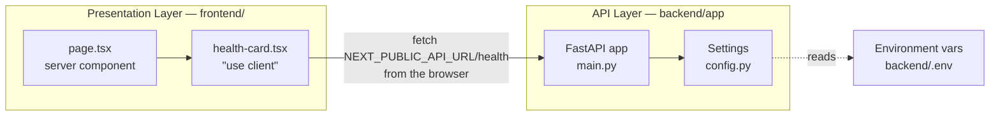

# ARCHITECTURE

**Honest to the code as of step 0.2.** This describes what is built, not what is planned.
The target architecture lives in [BUILD_PLAN.md](BUILD_PLAN.md); this file catches up to it
one step at a time.

## The layers, today

Two layers: a Next.js presentation layer and a FastAPI API layer. They are separate origins
that talk over HTTP/JSON. The API answers from memory — there is no database.



Of the target layers — presentation, API, service, data access, persistence — the
presentation and API layers exist. There is no service layer, no data access layer, and no
persistence.

## How a request flows

`GET /health` is the only route, and the one page calls it.

1. The browser requests `/`. Next.js server-renders `page.tsx`, which contains the clinic name
   and the `HealthCard`. The card's initial HTML shows its **loading** state.
2. In the browser, `HealthCard`'s `useEffect` fires and calls
   `${NEXT_PUBLIC_API_URL}/health` — a **cross-origin** request from `localhost:3000` to
   `localhost:8000`.
3. **uvicorn** accepts it and hands it to the ASGI app.
4. **CORSMiddleware** checks the `Origin` against `settings.cors_origins_list` (the
   `CORS_ORIGINS` env var, split on commas) and adds `Access-Control-Allow-Origin`.
5. The **`health()` handler** in [main.py](../backend/app/main.py) returns
   `{"status": "ok", "environment": settings.environment}`.
6. The card re-renders into **ok** (green, showing status + environment) or, if the fetch
   throws, **error** (red). The error state is a real state — the page does not crash when the
   backend is down.

No database is touched and no auth is checked — neither exists yet.

## Why the health call is client-side

`HealthCard` is a `"use client"` component and the fetch runs in the **browser**, deliberately.

The alternative — fetching from a server component — would run inside the Next.js container in
production, where the backend is reachable as `http://backend:8000` (a Docker service name).
That URL is meaningless to a browser on a clinic PC. Any config that worked server-side would
break client-side, and the failure surfaces as an opaque network/CORS error.

So: `NEXT_PUBLIC_API_URL` must always be a URL **the browser can reach**, and the call must be
client-side to match. `NEXT_PUBLIC_*` values are inlined at **build** time, not runtime — step
0.4's Dockerfile therefore has to pass it as a build arg.

## Configuration

All config comes from environment variables, read once at import time by the `Settings` class
in [config.py](../backend/app/config.py) and exposed as a module-level `settings` object.
Nothing is hardcoded — local and production will differ by config only.

| Setting | Env var | Side | Status |
|---|---|---|---|
| `environment` | `ENVIRONMENT` | backend | Used — returned by `/health`. |
| `cors_origins` | `CORS_ORIGINS` | backend | Used — feeds the CORS middleware. Comma-separated. Defaults to `http://localhost:3000`, which is where `next dev` serves. |
| `database_url` | `DATABASE_URL` | backend | Defined but unused until step 0.5. |
| — | `NEXT_PUBLIC_API_URL` | frontend | Used — the backend base URL the browser calls. Inlined at build time. |

`cors_origins` is typed as a `str` and split on commas by the `cors_origins_list` property
rather than being typed as `list[str]`, because pydantic-settings parses list-typed fields as
JSON — which would reject the plain `http://localhost:3000` form in a `.env` file.

## Current data model

None. There are no tables, no ORM models, and no migrations. The first model arrives in
Phase 2; the engine and Alembic scaffolding arrive in step 0.5.

## Deployment topology

None. Everything runs on one developer machine as two processes started by hand. There are no
containers, no proxy, and no hosting. Containers arrive in step 0.4; hosting is decided in
Phase 7.

```
developer machine
├── next dev (port 3000) → Next.js app  ─┐
└── uvicorn  (port 8000) → FastAPI app  ←┘ browser calls :8000 directly
```

`next.config.ts` sets `output: "standalone"`, so a production build emits a self-contained
server bundle at `.next/standalone/`. Nothing consumes it yet — step 0.4's Docker image will.
