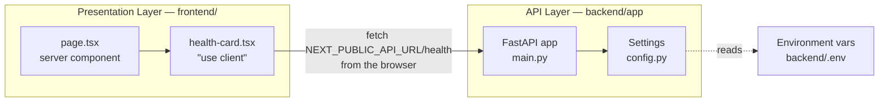
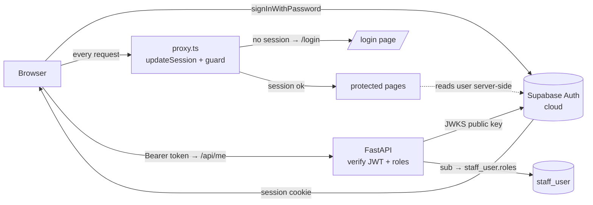
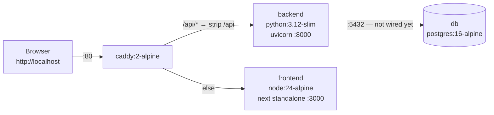

# ARCHITECTURE

**Honest to the code as of step 3.3 (Phase 3 in progress).** This describes what is built, not what
is planned.
The target architecture lives in [BUILD_PLAN.md](BUILD_PLAN.md); this file catches up to it
one step at a time.

## The layers, today

Two layers: a Next.js presentation layer and a FastAPI API layer. They are separate origins
that talk over HTTP/JSON. The API answers from memory — there is no database.

Of the target layers — presentation, API, service, data access, persistence — the
presentation and API layers exist. There is no service layer, no data access layer, and no
persistence.

## How a request flows

`GET /health` is the only route, and the one page calls it.

1. The browser requests `/`. Next.js server-renders `page.tsx`, which contains the clinic name
   and the `HealthCard`. The card's initial HTML shows its **loading** state.
2. In the browser, `HealthCard`'s `useEffect` fires and calls
   `${NEXT_PUBLIC_API_URL}/health` — a **cross-origin** request from `localhost:3000` to
   `localhost:8000`.
3. **uvicorn** accepts it and hands it to the ASGI app.
4. **CORSMiddleware** checks the `Origin` against `settings.cors_origins_list` (the
   `CORS_ORIGINS` env var, split on commas) and adds `Access-Control-Allow-Origin`.
5. The **`health()` handler** in [main.py](../backend/app/main.py) returns
   `{"status": "ok", "environment": settings.environment}`.
6. The card re-renders into **ok** (green, showing status + environment) or, if the fetch
   throws, **error** (red). The error state is a real state — the page does not crash when the
   backend is down.

No database is touched by `/health`, and the **backend** checks no auth (backend auth is 1.3).
Auth is enforced on the **frontend** by `proxy.ts` before protected pages render — see the
Authentication section below.

**Under Docker Compose the shape differs slightly:** the browser talks only to Caddy on
`http://localhost` and calls `http://localhost/api/health`. That is the **same origin** as the
page, so CORS is not exercised at all; Caddy strips `/api` and forwards to `backend:8000`. The
two-origin, CORS-exercising path above is the by-hand dev mode (`next dev` on :3000 calling
uvicorn on :8000). Both are supported; see the topology section.

## Why the health call is client-side

`HealthCard` is a `"use client"` component and the fetch runs in the **browser**, deliberately.

The alternative — fetching from a server component — would run inside the Next.js container in
production, where the backend is reachable as `http://backend:8000` (a Docker service name).
That URL is meaningless to a browser on a clinic PC. Any config that worked server-side would
break client-side, and the failure surfaces as an opaque network/CORS error.

So: `NEXT_PUBLIC_API_URL` must always be a URL **the browser can reach**, and the call must be
client-side to match. `NEXT_PUBLIC_*` values are inlined at **build** time, not runtime — step
0.4's Dockerfile therefore has to pass it as a build arg.

## Authentication & authorization (Supabase — steps 1.1 & 1.3)

Two layers work together:
- **Frontend (1.1):** signs the user in against Supabase, keeps the session in cookies, and
  guards routes (signed-in vs not) in `proxy.ts`.
- **Backend (1.3):** verifies the Supabase **JWT** on protected endpoints and enforces **roles**
  from our database. This is the real security boundary — "role checks on the API, not just
  hidden UI." The frontend's role-aware nav is only a convenience on top.

### API auth chain (backend, `app/auth.py`)

The endpoint dependencies, from raw request to an authorized staff member:

1. **`get_current_claims`** — reads the `Authorization: Bearer <token>` header, fetches the
   ES256 **public key** from Supabase's JWKS endpoint (`PyJWKClient`, cached), and
   `jwt.decode`s the token verifying signature + `audience="authenticated"` + issuer + expiry.
   Any failure → **401**. *The backend never holds a secret — tokens are asymmetric (ES256).*
2. **`get_current_staff`** — takes `claims["sub"]` (the Supabase UUID) and loads
   `staff_user` by primary key. No row, or `active = false` → **403**. A valid Supabase token
   means *authenticated*, not *authorized here*.
3. **`require_role(*roles)`** — a dependency factory; **403** unless the staff row holds one of
   the given roles. Phase 2 endpoints will decorate with `Depends(require_role("dentist", …))`.

`GET /me` uses (2) and returns the staff member + roles (the frontend nav's source of truth).
`GET /admin/ping` uses `require_role("admin")` and exists to demonstrate the 403 path.

**Roles come from our DB, not the token.** The token's `role` claim is the Postgres role
(`"authenticated"`); app roles live in `staff_user.roles`. So changing a user's roles or
deactivating them takes effect on the next request — no token reissue needed.

- **`lib/supabase/client.ts`** — browser client (`createBrowserClient`). Used by the login form
  and the sign-out button.
- **`lib/supabase/server.ts`** — server client (`createServerClient`) bound to Next's
  `cookies()`. Used by server components (e.g. `page.tsx` reads the signed-in user). Its cookie
  `setAll` is wrapped in try/catch because a Server Component may read but not write cookies.
- **`lib/supabase/middleware.ts` → `updateSession()`** — the session refresh + route guard,
  called from `proxy.ts` on every matched request. It calls `getUser()` (which refreshes an
  expired token), then: no user and not on `/login` → redirect to `/login`; signed-in user on
  `/login` → redirect to `/`. Refreshed cookies are copied onto redirects so the browser gets
  the fresh session.
- **`proxy.ts`** — the root request interceptor. *Next 16 renamed the `middleware` file
  convention to `proxy`; the API is identical.* Its `matcher` skips `_next/*` and static assets.

**Why the token can't refresh in a Server Component:** server components can read cookies but
not write them, so a rotated token couldn't be persisted. The proxy runs before the render and
*can* write cookies — that's why session refresh lives there. This is the standard
`@supabase/ssr` App Router pattern.

**No roles yet.** There is no `staff_user` table and no role concept in 1.1 — any authenticated
Supabase user reaches the app. Roles (`staff_user` + `roles` array) come in 1.2, and API-side
role guards + JWT verification in 1.3. Until then, `/api/*` is unauthenticated.

The two `NEXT_PUBLIC_SUPABASE_*` values are inlined at **build** time (like
`NEXT_PUBLIC_API_URL`), so they are build args in the Dockerfile and compose file, sourced from
the gitignored root `.env`.

## Configuration

All config comes from environment variables, read once at import time by the `Settings` class
in [config.py](../backend/app/config.py) and exposed as a module-level `settings` object.
Nothing is hardcoded — local and production will differ by config only.

| Setting | Env var | Side | Status |
|---|---|---|---|
| `environment` | `ENVIRONMENT` | backend | Used — returned by `/health`. |
| `cors_origins` | `CORS_ORIGINS` | backend | Used — feeds the CORS middleware. Comma-separated. Defaults to `http://localhost:3000`, which is where `next dev` serves. |
| `database_url` | `DATABASE_URL` | backend | Used — feeds the SQLAlchemy engine (`app/db.py`) and, separately, Alembic (`alembic/env.py`). |
| — | `NEXT_PUBLIC_API_URL` | frontend | Used — the backend base URL the browser calls. Inlined at **build** time. `http://localhost/api` under Docker (through Caddy); `http://localhost:8000` for by-hand dev. |
| — | `NEXT_PUBLIC_SUPABASE_URL` | frontend | Used — Supabase project base URL (`https://<ref>.supabase.co`, not the `/rest/v1` endpoint). Inlined at **build** time. |
| — | `NEXT_PUBLIC_SUPABASE_PUBLISHABLE_KEY` | frontend | Used — Supabase publishable (anon) key, safe in the browser. Inlined at **build** time. For Docker, both Supabase vars come from the gitignored root `.env`. |

`cors_origins` is typed as a `str` and split on commas by the `cors_origins_list` property
rather than being typed as `list[str]`, because pydantic-settings parses list-typed fields as
JSON — which would reject the plain `http://localhost:3000` form in a `.env` file.

## Data access layer

As of 3.2 there are four models — `staff_user`, `audit_log`, `patient`, `appointment` —
and two `app/services/` modules (`audit`, `appointments`).

- **`app/db.py`** — the SQLAlchemy `engine` (a connection pool to Postgres, `pool_pre_ping`
  on so dead pooled connections are replaced not reused), `SessionLocal` (a session =
  one transaction), and `get_db` (a FastAPI dependency that yields a session and always
  closes it).
- **`app/models/__init__.py`** — `Base`, the `DeclarativeBase` every model inherits from. It
  **imports each model** at the bottom so they register on `Base.metadata` by the time Alembic's
  `env.py` runs (otherwise `--autogenerate` sees an empty schema).
- **`app/models/staff_user.py`** — `StaffUser`. Its primary key **is the Supabase Auth user's
  UUID** (the JWT `sub`) — one identity, no separate linking column. `roles` is a Postgres
  `ARRAY(Text)` holding the set of roles (e.g. `["dentist","admin"]`), never a single string.
  `active` soft-disables a login; `email` mirrors the Supabase login email (unique).

- **`app/models/audit_log.py`** — `AuditLog`, the append-only "who changed what" trail
  (BUILD_PLAN §11). `id` is server-generated (`gen_random_uuid()`); `actor_id` is the acting
  `staff_user` (**nullable, no FK** — null = a system/seed action, and the trail must outlive the
  entities it references); `action`/`entity`/`entity_id` say what happened to which row;
  `details` is nullable `JSONB` for context (a small, deliberate extension beyond the ERD). Rows
  are only ever inserted.
- **`app/services/audit.py` → `record_audit(db, *, actor_id, action, entity, entity_id, details)`**
  — the single way anything writes an audit row. It inserts into the **caller's** session and
  flushes but does **not** commit, so the audit entry and the change it records commit atomically
  in one transaction. Phase 2 mutation endpoints call it with `actor_id=current_staff.id`; the
  seed calls it with `actor_id=None`.
- **`app/models/patient.py`** — `Patient`, the first patient-data model (Phase 2). Soft-delete
  only via `archived` (never hard-deleted — medico-legal retention). Stores `date_of_birth`
  (nullable) and computes `age` via a read-only `@property` rather than storing a stale int.
  `medical_notes` is one free-text field (renders as a banner later). `created_at`/`updated_at`
  timestamps. No endpoints yet — CRUD is 2.2.
- **`app/models/appointment.py`** — `Appointment`, a booked calendar slot (Phase 3, step 3.1).
  **The schema's first table with foreign keys:** `patient_id → patient.id` (NOT NULL — always
  belongs to a patient) and `dentist_id → staff_user.id` (nullable — a slot may be unassigned).
  `treatment_id` is a **bare nullable UUID with no FK yet** — the `treatment` table doesn't exist
  until Phase 4, so its FK constraint is deferred to 4.2 (a first booking has no treatment; a
  follow-up does). `start_time` (timestamptz), `duration_min` (default 30), `status` (default
  `booked` — the transition *workflow* is 3.5, this step is only the column), `reason` (free
  text), `created_at`/`updated_at`. No `relationship()` navigations yet. Endpoints arrived in 3.2
  (see the booking API below).
- **`app/services/appointments.py`** — the **second `services/` module** (3.2). `find_conflicts()`
  is the app-side half of double-booking prevention: it returns non-cancelled appointments for the
  same dentist whose half-open time span `[start, start+duration)` overlaps a proposed slot. It's a
  UX layer (a friendly 409) on top of the real guarantee, which is the DB constraint — the two use
  the identical UTC `tsrange` overlap expression so they always agree. Returns `[]` for an
  unassigned (`dentist_id is None`) slot.

**Why roles live here, not in Supabase:** Supabase Auth owns credentials; our app owns
authorization. Keeping `roles` in our Postgres means role checks are plain SQL the backend
controls — which is exactly what the 1.3 auth chain does (verify JWT → `sub` → `staff_user` by
PK → roles).

`get_db` is used by `get_current_staff` and by the patient/appointment routes. Routes so far:
`/health`, `/me`, `/admin/ping`, the **patient CRUD** (`POST /patients`, `GET/PATCH
/patients/{id}`, `POST /patients/{id}/archive|unarchive`), and the **appointment booking API**
(`POST /appointments`, `GET /appointments/{id}`, `GET /appointments?date=`, `PATCH
/appointments/{id}`).

### First resource API (patients — step 2.2)

The patient endpoints (`app/routers/patients.py`, schemas in `app/schemas/patient.py`) are where
the full stack finally runs end to end: **auth** (`get_current_staff` guards every route — any
active staff) → **model** (`Patient`) → **DB** (`get_db`), and every mutation writes an
**audit** row via `record_audit` in the *same transaction* as the change (one `db.commit()`), so
the change and its audit entry are atomic. Reads are not audited. Deletes are **soft**
(`archived` flag) — there is no hard-delete route. Patient ids are path params, never query
strings.

`GET /patients` (2.3) adds list + search: a `q` param does a case-insensitive substring match on
name **or** phone (plain `ILIKE` — no index needed at clinic scale; a `pg_trgm` GIN index is the
escalation path if the table grows), with `include_archived`, `limit`/`offset`, and a `total`
count. List rows use a lighter `PatientListItem` that **omits `medical_notes`** — sensitive notes
are only returned by `GET /patients/{id}`, never in bulk.

### Booking API + double-booking prevention (appointments — step 3.2)

The appointment endpoints (`app/routers/appointments.py`, schemas in
`app/schemas/appointment.py`) follow the patient-router shape exactly — `get_current_staff` on
every route, audited mutations, ids as path params (the day filter is a query *date*, not a
patient identifier, so it's allowed). `POST` books (404 if the patient is unknown),
`GET /{id}` reads, `GET ?date=YYYY-MM-DD` lists a day ordered by start time (the day-view's data
source), and `PATCH` reschedules. The day list returns a lighter `AppointmentListItem` that adds
the resolved **`patient_name` and `dentist_name`** (via a join to `patient` and an outer-join to
`staff_user` — the dentist is nullable), so the calendar can show who each appointment is for
without an N+1 of per-row lookups (3.3).

**Double-booking prevention lives in two layers, and the DB layer is the real one:**

1. **The database — a GiST `EXCLUDE` constraint (`appointment_no_overlap`).** It makes two
   overlapping, non-cancelled appointments for the *same dentist* physically impossible to store,
   enforced atomically at commit. This is what survives the race BUILD_PLAN §11 warns about — two
   clinic PCs booking the same slot at the same instant cannot both succeed. Overlap is defined on
   half-open ranges `[start, start + duration_min)`, so back-to-back slots (…10:30 and 10:30…) do
   **not** clash. The `WHERE (status <> 'cancelled')` clause means a cancelled slot frees its time.
   `dentist_id WITH =` treats NULLs as distinct, so unassigned bookings never conflict.
2. **The service — `find_conflicts()`.** Runs the same overlap test in the app before inserting so
   the ordinary case returns a friendly **409** with a clear message. The router's
   `_commit_or_conflict` also catches the constraint's `IntegrityError` (the race that slips past
   the pre-check) and translates it to the **same 409**, never a 500.

**Immutability detail (why the constraint expression looks the way it does):** a constraint/index
expression must be IMMUTABLE, but `timestamptz + interval` is only STABLE (it depends on the
session TimeZone). So both the constraint and `find_conflicts` build the range in UTC wall-clock:
`tsrange(timezone('UTC', start_time), timezone('UTC', start_time) + duration_min * interval '1
minute', '[)')`. `timezone('UTC', ts)` casts to a fixed-zone plain `timestamp` (immutable) and
plain `timestamp + interval` is immutable. Two appointments overlap in real time iff their UTC
representations overlap, so the rewrite is equivalent.

### Frontend patient page + first navigation (2.3)

`/patients` (`app/patients/`) is the first patient-facing screen: a debounced search box
(`lib/use-patient-search.ts`, same authed browser→Caddy→`/api` fetch pattern as
`use-current-staff`) over a Tailwind results table. It's reachable via the **first in-app
navigation** — `app/role-nav.tsx` gained an `href` on nav items and a `next/link` "Patients"
link (nothing used `next/link` before; other nav items remain placeholder spans until their pages
exist).

`/patients/{id}` (`app/patients/[id]/`, step 2.4) is the **profile page** and the app's first
**dynamic route**. It fetches the full patient (`lib/use-patient.ts` → `GET /patients/{id}`, the
one endpoint that returns `medical_notes`) and shows demographics in a `Card` plus the
**medical-notes banner** — a prominent amber alert that renders *only* when `medical_notes` is
non-empty (BUILD_PLAN §1: the one diabetic/blood-thinner patient is exactly where it matters).
Read-only this step; list rows link into it. The id is a **path segment** (allowed — the
no-id-in-URL rule is about query strings).

### Day-view calendar (appointments — step 3.3)

`/calendar` (`app/calendar/`) is the first appointment screen: a **read-only day view** with date
navigation (Prev / Today / Next + a native `<input type="date">`). `lib/use-day-appointments.ts`
(same authed browser→Caddy→`/api` fetch pattern, no debounce) calls `GET /appointments?date=` and
renders a Tailwind table — time range (`HH:MM–HH:MM` from `start_time` + `duration_min`), patient
(linking to `/patients/{id}`), dentist, a neutral status pill, and reason — with loading / error /
empty states. A **Calendar** link was added to `app/role-nav.tsx` (any staff). No booking or status
UI yet (later steps).

**Timezone caveat:** the day list is bounded by **UTC** day edges and the browser renders times in
its **local** zone. The clinic is IST with no clinic-timezone setting yet (Phase 4), so an IST
evening appointment can technically fall on the next UTC day. Consistent with the app's
UTC-everywhere handling; a proper fix waits for the Phase-4 clinic-timezone config.

### Seeding (`app/seed.py`)

`python -m app.seed` upserts the admin `staff_user` row from `ADMIN_USER_ID` / `ADMIN_EMAIL` /
`ADMIN_NAME` (idempotent — safe to re-run). `ADMIN_USER_ID` is the admin's Supabase UUID, so the
seeded row's PK matches their Auth identity. Run it once per environment after migrating:
`docker compose run --rm backend python -m app.seed`.

`python -m app.seed_patients` (step 2.5) is a **dev-data** seed: ~50 fake patients (hand-rolled
Indian names, stdlib random, no faker). Idempotent via a count guard (skips if ≥50 already
present; never deletes patient rows). Writes one summary audit row. Split into a pure
`generate_patients()` (unit-testable) and the DB `seed_patients()`. **Fake data only** — no real
patient data on a dev machine until Phase 7.

## Migrations (Alembic)

Schema changes go through Alembic migrations — never manual SQL against live data. This is
how the schema evolves without losing patient records.

- Migration files live in `backend/alembic/versions/`. Each has a `revision` id and a
  `down_revision` pointing at the previous one, forming an ordered chain Alembic walks on
  `upgrade`/`downgrade`. The root is the **empty** `78e9327c7254` (`down_revision = None`); the
  current head is `feae714ecef5` (the appointment no-overlap constraint).
- Alembic tracks which revision the database is at in an `alembic_version` table it manages.
- Most migrations are **autogenerated** (`--autogenerate` diffs `Base.metadata` against the live
  DB). The exception is `feae714ecef5` (3.2), the first **hand-written** migration: autogenerate
  cannot express a GiST `EXCLUDE` constraint or `CREATE EXTENSION`, so its body is raw
  `op.execute(...)` SQL. It also needs the `btree_gist` extension, which the migration creates.
- **The DB URL is not in `alembic.ini`.** That line was deleted; `alembic/env.py` reads
  `os.environ["DATABASE_URL"]` instead. No fallback means a migration **cannot run** without
  an explicit `DATABASE_URL` — so nobody can accidentally migrate the wrong database. Proven:
  running Alembic with an empty/missing `DATABASE_URL` errors out and connects to nothing.
- `env.py`'s `target_metadata = Base.metadata`, so `--autogenerate` will detect models
  automatically once they exist.
- **Migrations ship inside the backend image** (the Dockerfile copies `alembic/` and
  `alembic.ini`), so migration code and app code can never drift. Run them with
  `docker compose run --rm backend alembic upgrade head`.

## Deployment topology

Local only. The whole stack runs on one machine under Docker Compose (`docker-compose.yml`).
No hosting, no TLS, no domain — those are Phase 7.

**Caddy is the only service that publishes a host port** (`80:80`). backend (:8000), frontend
(:3000), and db (:5432) are reachable only on the internal compose network — the browser never
hits them directly. This is what lets `NEXT_PUBLIC_API_URL` be `http://localhost/api`.

Two footguns this step had to handle, both verified:
- **`NEXT_PUBLIC_API_URL` is a build arg**, not a runtime env var — it is inlined into the
  browser bundle during `npm run build`. The frontend Dockerfile sets it via `ARG`/`ENV`
  before the build; compose passes it.
- **The standalone build omits `.next/static` and `public/`.** The frontend Dockerfile's
  runner stage copies all three (`standalone`, `static`, `public`) or the page loads unstyled.

**Postgres runs but is not connected.** No app code opens `DATABASE_URL` yet — the db service
exists so the compose topology is complete and healthchecked. Wiring is step 0.5.

### By-hand dev (no Docker)

Still supported and often faster for frontend work: run `uvicorn` and `next dev` directly (see
[PROJECT.md](PROJECT.md)). In that mode the browser calls `http://localhost:8000` cross-origin,
and the backend's `CORS_ORIGINS` allows `http://localhost:3000`.
