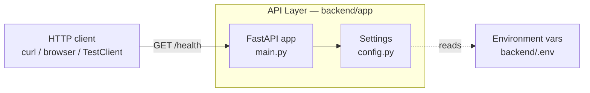

# ARCHITECTURE

**Honest to the code as of step 0.2.** This describes what is built, not what is planned.
The target architecture lives in [BUILD_PLAN.md](BUILD_PLAN.md); this file catches up to it
one step at a time.

## The layers, today

There is one layer. A client calls the API directly, and the API answers from memory.



Of the target layers — presentation, API, service, data access, persistence — only the API
layer exists.

## How a request flows

`GET /health` is the only route.

1. **uvicorn** accepts the connection and hands the request to the ASGI app.
2. **CORSMiddleware** checks the request origin against `settings.cors_origins_list`, which is
   the `CORS_ORIGINS` env var split on commas.
3. The **`health()` handler** in [main.py](../backend/app/main.py) returns
   `{"status": "ok", "environment": settings.environment}`.
4. FastAPI serialises it to JSON.

No database is touched, no auth is checked, no service layer is consulted — none of those
exist yet.

## Configuration

All config comes from environment variables, read once at import time by the `Settings` class
in [config.py](../backend/app/config.py) and exposed as a module-level `settings` object.
Nothing is hardcoded — local and production will differ by config only.

| Setting | Env var | Status |
|---|---|---|
| `environment` | `ENVIRONMENT` | Used — returned by `/health`. |
| `cors_origins` | `CORS_ORIGINS` | Used — feeds the CORS middleware. Comma-separated. |
| `database_url` | `DATABASE_URL` | Defined but unused until step 0.5. |

`cors_origins` is typed as a `str` and split on commas by the `cors_origins_list` property
rather than being typed as `list[str]`, because pydantic-settings parses list-typed fields as
JSON — which would reject the plain `http://localhost:3000` form in a `.env` file.

## Current data model

None. There are no tables, no ORM models, and no migrations. The first model arrives in
Phase 2; the engine and Alembic scaffolding arrive in step 0.5.

## Deployment topology

None. Everything runs on one developer machine as a single uvicorn process. There are no
containers, no proxy, and no hosting. Containers arrive in step 0.4; hosting is decided in
Phase 7.

```
developer machine
└── uvicorn (port 8000) → FastAPI app
```
