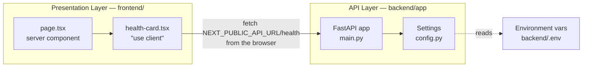
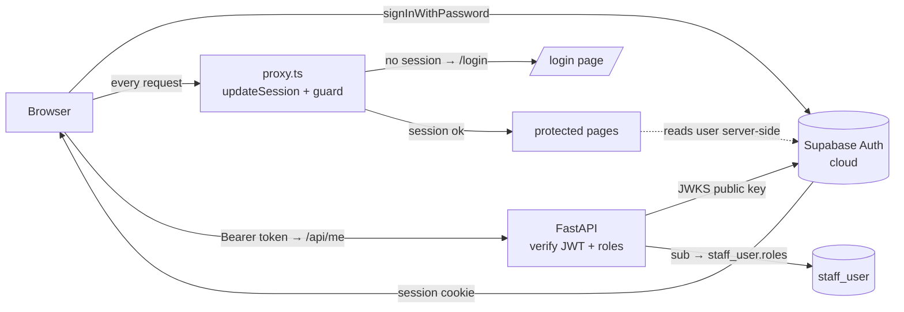
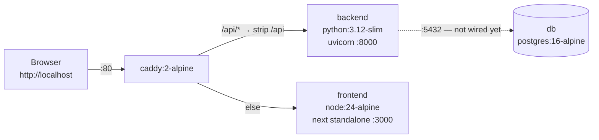

# ARCHITECTURE

**Honest to the code as of step 1.4 (Phase 1 complete).** This describes what is built, not
what is planned.
The target architecture lives in [BUILD_PLAN.md](BUILD_PLAN.md); this file catches up to it
one step at a time.

## The layers, today

Two layers: a Next.js presentation layer and a FastAPI API layer. They are separate origins
that talk over HTTP/JSON. The API answers from memory — there is no database.

Of the target layers — presentation, API, service, data access, persistence — the
presentation and API layers exist. There is no service layer, no data access layer, and no
persistence.

## How a request flows

`GET /health` is the only route, and the one page calls it.

1. The browser requests `/`. Next.js server-renders `page.tsx`, which contains the clinic name
   and the `HealthCard`. The card's initial HTML shows its **loading** state.
2. In the browser, `HealthCard`'s `useEffect` fires and calls
   `${NEXT_PUBLIC_API_URL}/health` — a **cross-origin** request from `localhost:3000` to
   `localhost:8000`.
3. **uvicorn** accepts it and hands it to the ASGI app.
4. **CORSMiddleware** checks the `Origin` against `settings.cors_origins_list` (the
   `CORS_ORIGINS` env var, split on commas) and adds `Access-Control-Allow-Origin`.
5. The **`health()` handler** in [main.py](../backend/app/main.py) returns
   `{"status": "ok", "environment": settings.environment}`.
6. The card re-renders into **ok** (green, showing status + environment) or, if the fetch
   throws, **error** (red). The error state is a real state — the page does not crash when the
   backend is down.

No database is touched by `/health`, and the **backend** checks no auth (backend auth is 1.3).
Auth is enforced on the **frontend** by `proxy.ts` before protected pages render — see the
Authentication section below.

**Under Docker Compose the shape differs slightly:** the browser talks only to Caddy on
`http://localhost` and calls `http://localhost/api/health`. That is the **same origin** as the
page, so CORS is not exercised at all; Caddy strips `/api` and forwards to `backend:8000`. The
two-origin, CORS-exercising path above is the by-hand dev mode (`next dev` on :3000 calling
uvicorn on :8000). Both are supported; see the topology section.

## Why the health call is client-side

`HealthCard` is a `"use client"` component and the fetch runs in the **browser**, deliberately.

The alternative — fetching from a server component — would run inside the Next.js container in
production, where the backend is reachable as `http://backend:8000` (a Docker service name).
That URL is meaningless to a browser on a clinic PC. Any config that worked server-side would
break client-side, and the failure surfaces as an opaque network/CORS error.

So: `NEXT_PUBLIC_API_URL` must always be a URL **the browser can reach**, and the call must be
client-side to match. `NEXT_PUBLIC_*` values are inlined at **build** time, not runtime — step
0.4's Dockerfile therefore has to pass it as a build arg.

## Authentication & authorization (Supabase — steps 1.1 & 1.3)

Two layers work together:
- **Frontend (1.1):** signs the user in against Supabase, keeps the session in cookies, and
  guards routes (signed-in vs not) in `proxy.ts`.
- **Backend (1.3):** verifies the Supabase **JWT** on protected endpoints and enforces **roles**
  from our database. This is the real security boundary — "role checks on the API, not just
  hidden UI." The frontend's role-aware nav is only a convenience on top.

### API auth chain (backend, `app/auth.py`)

The endpoint dependencies, from raw request to an authorized staff member:

1. **`get_current_claims`** — reads the `Authorization: Bearer <token>` header, fetches the
   ES256 **public key** from Supabase's JWKS endpoint (`PyJWKClient`, cached), and
   `jwt.decode`s the token verifying signature + `audience="authenticated"` + issuer + expiry.
   Any failure → **401**. *The backend never holds a secret — tokens are asymmetric (ES256).*
2. **`get_current_staff`** — takes `claims["sub"]` (the Supabase UUID) and loads
   `staff_user` by primary key. No row, or `active = false` → **403**. A valid Supabase token
   means *authenticated*, not *authorized here*.
3. **`require_role(*roles)`** — a dependency factory; **403** unless the staff row holds one of
   the given roles. Phase 2 endpoints will decorate with `Depends(require_role("dentist", …))`.

`GET /me` uses (2) and returns the staff member + roles (the frontend nav's source of truth).
`GET /admin/ping` uses `require_role("admin")` and exists to demonstrate the 403 path.

**Roles come from our DB, not the token.** The token's `role` claim is the Postgres role
(`"authenticated"`); app roles live in `staff_user.roles`. So changing a user's roles or
deactivating them takes effect on the next request — no token reissue needed.

- **`lib/supabase/client.ts`** — browser client (`createBrowserClient`). Used by the login form
  and the sign-out button.
- **`lib/supabase/server.ts`** — server client (`createServerClient`) bound to Next's
  `cookies()`. Used by server components (e.g. `page.tsx` reads the signed-in user). Its cookie
  `setAll` is wrapped in try/catch because a Server Component may read but not write cookies.
- **`lib/supabase/middleware.ts` → `updateSession()`** — the session refresh + route guard,
  called from `proxy.ts` on every matched request. It calls `getUser()` (which refreshes an
  expired token), then: no user and not on `/login` → redirect to `/login`; signed-in user on
  `/login` → redirect to `/`. Refreshed cookies are copied onto redirects so the browser gets
  the fresh session.
- **`proxy.ts`** — the root request interceptor. *Next 16 renamed the `middleware` file
  convention to `proxy`; the API is identical.* Its `matcher` skips `_next/*` and static assets.

**Why the token can't refresh in a Server Component:** server components can read cookies but
not write them, so a rotated token couldn't be persisted. The proxy runs before the render and
*can* write cookies — that's why session refresh lives there. This is the standard
`@supabase/ssr` App Router pattern.

**No roles yet.** There is no `staff_user` table and no role concept in 1.1 — any authenticated
Supabase user reaches the app. Roles (`staff_user` + `roles` array) come in 1.2, and API-side
role guards + JWT verification in 1.3. Until then, `/api/*` is unauthenticated.

The two `NEXT_PUBLIC_SUPABASE_*` values are inlined at **build** time (like
`NEXT_PUBLIC_API_URL`), so they are build args in the Dockerfile and compose file, sourced from
the gitignored root `.env`.

## Configuration

All config comes from environment variables, read once at import time by the `Settings` class
in [config.py](../backend/app/config.py) and exposed as a module-level `settings` object.
Nothing is hardcoded — local and production will differ by config only.

| Setting | Env var | Side | Status |
|---|---|---|---|
| `environment` | `ENVIRONMENT` | backend | Used — returned by `/health`. |
| `cors_origins` | `CORS_ORIGINS` | backend | Used — feeds the CORS middleware. Comma-separated. Defaults to `http://localhost:3000`, which is where `next dev` serves. |
| `database_url` | `DATABASE_URL` | backend | Used — feeds the SQLAlchemy engine (`app/db.py`) and, separately, Alembic (`alembic/env.py`). |
| — | `NEXT_PUBLIC_API_URL` | frontend | Used — the backend base URL the browser calls. Inlined at **build** time. `http://localhost/api` under Docker (through Caddy); `http://localhost:8000` for by-hand dev. |
| — | `NEXT_PUBLIC_SUPABASE_URL` | frontend | Used — Supabase project base URL (`https://<ref>.supabase.co`, not the `/rest/v1` endpoint). Inlined at **build** time. |
| — | `NEXT_PUBLIC_SUPABASE_PUBLISHABLE_KEY` | frontend | Used — Supabase publishable (anon) key, safe in the browser. Inlined at **build** time. For Docker, both Supabase vars come from the gitignored root `.env`. |

`cors_origins` is typed as a `str` and split on commas by the `cors_origins_list` property
rather than being typed as `list[str]`, because pydantic-settings parses list-typed fields as
JSON — which would reject the plain `http://localhost:3000` form in a `.env` file.

## Data access layer

As of 1.4 there are two models — `staff_user` and `audit_log` — plus the first
`app/services/` module.

- **`app/db.py`** — the SQLAlchemy `engine` (a connection pool to Postgres, `pool_pre_ping`
  on so dead pooled connections are replaced not reused), `SessionLocal` (a session =
  one transaction), and `get_db` (a FastAPI dependency that yields a session and always
  closes it).
- **`app/models/__init__.py`** — `Base`, the `DeclarativeBase` every model inherits from. It
  **imports each model** at the bottom so they register on `Base.metadata` by the time Alembic's
  `env.py` runs (otherwise `--autogenerate` sees an empty schema).
- **`app/models/staff_user.py`** — `StaffUser`. Its primary key **is the Supabase Auth user's
  UUID** (the JWT `sub`) — one identity, no separate linking column. `roles` is a Postgres
  `ARRAY(Text)` holding the set of roles (e.g. `["dentist","admin"]`), never a single string.
  `active` soft-disables a login; `email` mirrors the Supabase login email (unique).

- **`app/models/audit_log.py`** — `AuditLog`, the append-only "who changed what" trail
  (BUILD_PLAN §11). `id` is server-generated (`gen_random_uuid()`); `actor_id` is the acting
  `staff_user` (**nullable, no FK** — null = a system/seed action, and the trail must outlive the
  entities it references); `action`/`entity`/`entity_id` say what happened to which row;
  `details` is nullable `JSONB` for context (a small, deliberate extension beyond the ERD). Rows
  are only ever inserted.
- **`app/services/audit.py` → `record_audit(db, *, actor_id, action, entity, entity_id, details)`**
  — the single way anything writes an audit row. It inserts into the **caller's** session and
  flushes but does **not** commit, so the audit entry and the change it records commit atomically
  in one transaction. Phase 2 mutation endpoints call it with `actor_id=current_staff.id`; the
  seed calls it with `actor_id=None`.

**Why roles live here, not in Supabase:** Supabase Auth owns credentials; our app owns
authorization. Keeping `roles` in our Postgres means role checks are plain SQL the backend
controls — which is exactly what the 1.3 auth chain does (verify JWT → `sub` → `staff_user` by
PK → roles).

`get_db` is now used by `get_current_staff` (via `/me` and any role-guarded route). The only
routes so far are `/health`, `/me`, and `/admin/ping`; resource endpoints (patients etc.) arrive
in Phase 2 and will hang off `require_role(...)`.

### Seeding (`app/seed.py`)

`python -m app.seed` upserts the admin `staff_user` row from `ADMIN_USER_ID` / `ADMIN_EMAIL` /
`ADMIN_NAME` (idempotent — safe to re-run). `ADMIN_USER_ID` is the admin's Supabase UUID, so the
seeded row's PK matches their Auth identity. Run it once per environment after migrating:
`docker compose run --rm backend python -m app.seed`.

## Migrations (Alembic)

Schema changes go through Alembic migrations — never manual SQL against live data. This is
how the schema evolves without losing patient records.

- Migration files live in `backend/alembic/versions/`. Each has a `revision` id and a
  `down_revision` pointing at the previous one, forming an ordered chain Alembic walks on
  `upgrade`/`downgrade`. The first (and currently only) migration is **empty** —
  `78e9327c7254`, with `down_revision = None` (the root).
- Alembic tracks which revision the database is at in an `alembic_version` table it manages.
- **The DB URL is not in `alembic.ini`.** That line was deleted; `alembic/env.py` reads
  `os.environ["DATABASE_URL"]` instead. No fallback means a migration **cannot run** without
  an explicit `DATABASE_URL` — so nobody can accidentally migrate the wrong database. Proven:
  running Alembic with an empty/missing `DATABASE_URL` errors out and connects to nothing.
- `env.py`'s `target_metadata = Base.metadata`, so `--autogenerate` will detect models
  automatically once they exist.
- **Migrations ship inside the backend image** (the Dockerfile copies `alembic/` and
  `alembic.ini`), so migration code and app code can never drift. Run them with
  `docker compose run --rm backend alembic upgrade head`.

## Deployment topology

Local only. The whole stack runs on one machine under Docker Compose (`docker-compose.yml`).
No hosting, no TLS, no domain — those are Phase 7.

**Caddy is the only service that publishes a host port** (`80:80`). backend (:8000), frontend
(:3000), and db (:5432) are reachable only on the internal compose network — the browser never
hits them directly. This is what lets `NEXT_PUBLIC_API_URL` be `http://localhost/api`.

Two footguns this step had to handle, both verified:
- **`NEXT_PUBLIC_API_URL` is a build arg**, not a runtime env var — it is inlined into the
  browser bundle during `npm run build`. The frontend Dockerfile sets it via `ARG`/`ENV`
  before the build; compose passes it.
- **The standalone build omits `.next/static` and `public/`.** The frontend Dockerfile's
  runner stage copies all three (`standalone`, `static`, `public`) or the page loads unstyled.

**Postgres runs but is not connected.** No app code opens `DATABASE_URL` yet — the db service
exists so the compose topology is complete and healthchecked. Wiring is step 0.5.

### By-hand dev (no Docker)

Still supported and often faster for frontend work: run `uvicorn` and `next dev` directly (see
[PROJECT.md](PROJECT.md)). In that mode the browser calls `http://localhost:8000` cross-origin,
and the backend's `CORS_ORIGINS` allows `http://localhost:3000`.
