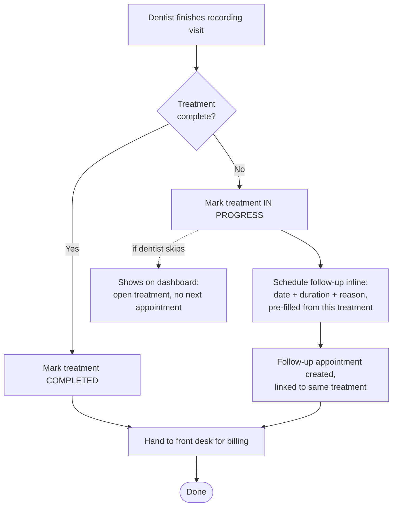
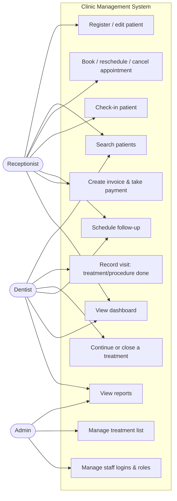
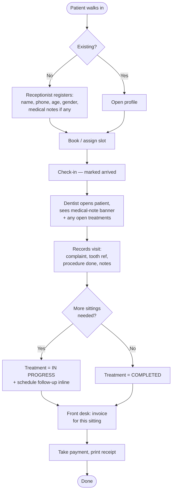
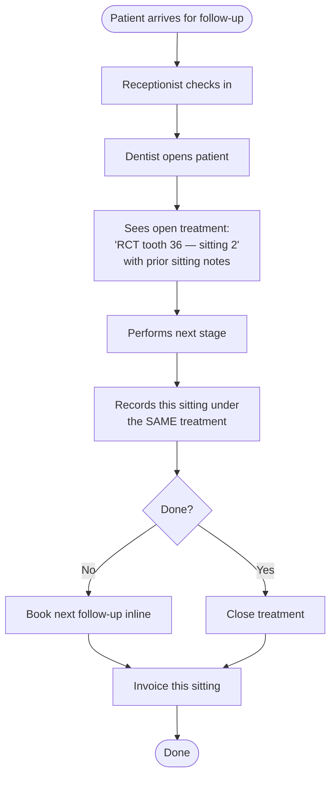
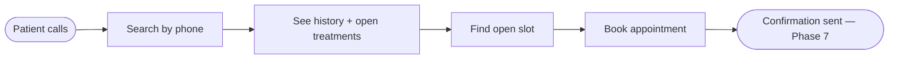
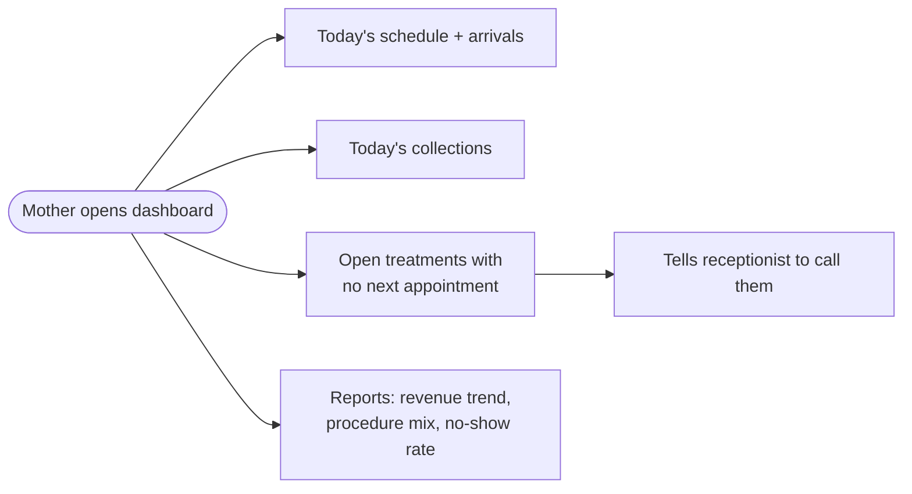
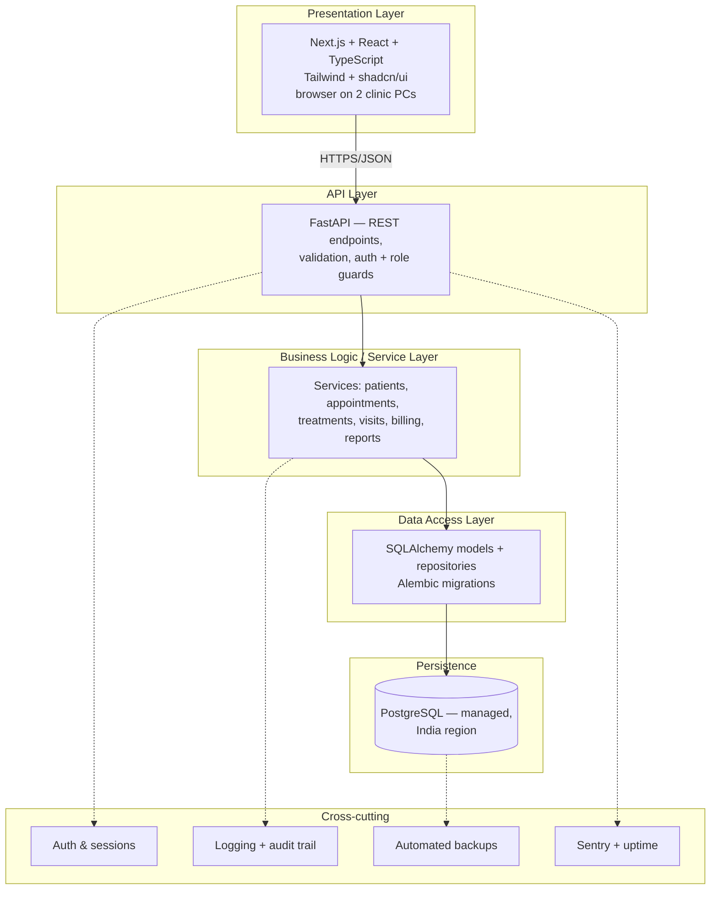
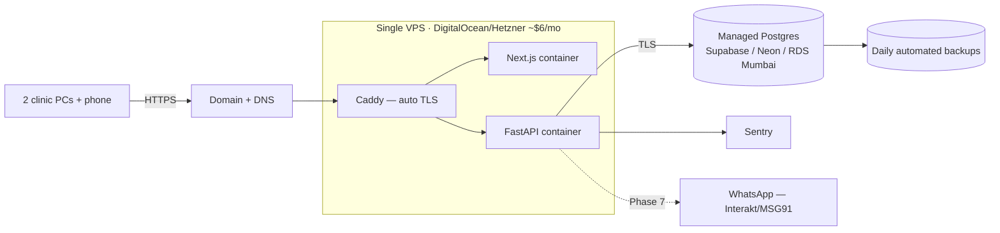
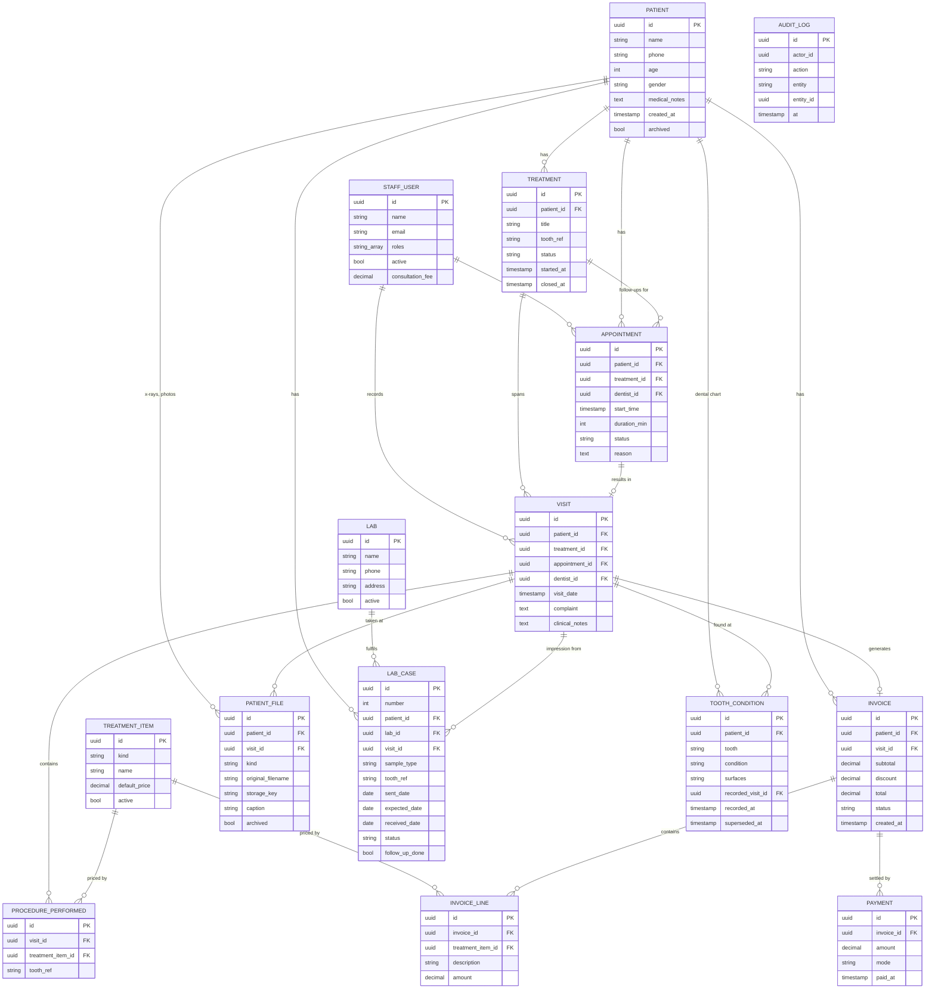

# Dental Clinic Management System — Build Plan & Architecture

> A production-grade clinic management web app for a single small dental clinic in Davangere. 2 computers, 2–3 users, staff-only (no patient logins). Built on weekends, deployed from day one, running in parallel with a bought vendor until proven.
>
> **Use this as `CLAUDE.md` at the project root.** Build one step at a time, commit after each.

---

## 1. Scope

**In scope:**
- Patient records (profile + history)
- Appointments & scheduling
- Visits — recording the treatment/procedure performed
- **Follow-up scheduling** — booking the next sitting from within the visit
- Billing & payments
- Dashboard & basic reports
- Staff auth with 3 roles

**Explicitly OUT of scope** (decided, not deferred — do not build these):
- ~~Prescriptions~~ · ~~Treatment plans (quoted/estimated)~~ · ~~Consent forms~~ · ~~Dental charting / odontogram~~ · ~~Inventory~~ · ~~Lab work tracking~~ · ~~Patient portal / patient logins~~ · ~~Insurance claims~~

> **Three of these were later brought back IN, each at the clinic owner's explicit request:**
> patient file uploads (5.6), lab work tracking (6.6), and **dental charting / the odontogram
> (6.11)**. The rest still stand. See §10 and `docs/LOG.md`.

**Rationale:** small tier-2 city clinic, cash-pay, two staff. The above are where big vendors spend their complexity budget and where this project would die before shipping.

### Two scope notes worth reading

**1. Billing needs prices from somewhere.** The rate card was cut, but billing can't invent prices. Two options:
- **(a) Free-text line items** — receptionist types treatment name + amount on every invoice. Zero build cost, but repetitive, typo-prone, and it makes "revenue by procedure" reporting impossible (every row is a different spelling of "Cleaning").
- **(b) A tiny treatment list** — one flat table in Settings: name + default price. ~1 evening of work. Invoice lines pick from it; price stays editable per invoice.

**Recommendation: (b).** It's not the "rate card module" you cut — it's a dropdown with a price. One evening, and it's what makes your reports mean anything. *If you disagree, (a) is genuinely fine and you can add (b) later.*

**2. Medical history / allergies — keep the field, drop the ceremony.** You're right that it's an exception, not the norm. But "exception" is exactly why it matters: the one diabetic or blood-thinner patient is the one where it counts. So: **one free-text `medical_notes` field on the patient profile that renders as a banner if non-empty.** No structured allergy tables, no drug-interaction logic. Costs nearly nothing, covers the exception.

---

## 2. Roles

Three roles. Staff-only — no patient access. **Three logins as of 6.12**, one per role.

| Role | Who | Access |
|---|---|---|
| **Receptionist** | Front-desk staff | Register/edit patients, book/reschedule/cancel appointments, check-in, **schedule follow-ups**, create invoices, take payments, view today's dashboard. **No reports, no day total.** |
| **Dentist** | The clinic's dentists (a shared login) | Everything Receptionist can do, **plus** record visits/treatments, close or continue a treatment, **schedule follow-ups from the visit screen**. **No reports, no day total** (narrowed in 6.12). |
| **Admin** | Your mother, the owner | Everything, **plus** the **Reports page and today's collections**, manage staff, edit the price list, clinic settings |

> **Important:** your mother is one person who is both Dentist and Admin. Don't make her log in twice. Model permissions as a **set** — let one user hold `["dentist", "admin"]`. A single `role` string column forces an awkward `"dentist_admin"` hack later. Use a `roles` array from the start.

> **6.12 — the money is admin-only.** The owner asked that the practice's takings sit behind her
> login alone, so **`GET /reports` and `GET /invoices/collections` are `require_role("admin")`**.
> The dentist role *lost* reports in that change (it had them from 6.1). Billing an individual
> patient deliberately did **not** move — that is front-desk work, and narrowing it would break the
> receptionist on day one. The three logins are **shared role accounts, not one per person**: which
> dentist treated a patient is recorded by the dentist dropdown, as it has been since 6.5.

---

## 3. The clinical model — treatments, visits, follow-ups

This is the core of the app and the part most worth getting right.

**The reality:** a patient comes in with a complaint. The dentist does a procedure. It may finish today, or need 2–4 more sittings across weeks. RCT is the classic case — clean and shape at visit 1 with a temporary filling, permanent seal and crown at a follow-up visit. The number of sittings depends on infection severity, tooth anatomy, and how the tooth responds — **so the dentist frequently does not know the visit count upfront.**

**What this means:** you cannot model a visit as a standalone event. You need a thread.

```
PATIENT
   └── TREATMENT (a case: "RCT on tooth 36", status: in_progress)
          ├── VISIT 1  (2 Aug  — access opening, temp filling)   → invoice
          ├── VISIT 2  (9 Aug  — cleaning & shaping)             → invoice
          └── VISIT 3  (20 Aug — obturation + crown)             → invoice, treatment closed
```

**A `TREATMENT` is NOT a treatment plan.** No cost estimate, no quote, no acceptance tracking, no multi-option presentation. It is only: *what is being done, to which tooth, is it still ongoing.* It exists so that:
- The dentist opens a patient and instantly sees **"RCT tooth 36 — in progress, 2 sittings done"** instead of three disconnected notes.
- Follow-ups attach to something meaningful.
- The dashboard can show **"open treatments with no next appointment booked"** — the single most valuable report in the app, because that's revenue walking out the door.

**Simple cases stay simple:** a one-visit cleaning is a Treatment with exactly one Visit, auto-created and auto-closed. The receptionist never has to think about the word "treatment" — the UI just says "Cleaning — done."

### Follow-up scheduling (your requirement)

The follow-up must be bookable **from inside the visit screen, in the same flow** — not as a separate "now go to the calendar" trip. That's the difference between it getting used and not.



> Both the dentist **and** the receptionist can schedule follow-ups — the dentist inline from the visit, the receptionist from the patient profile or calendar.

---

## 4. Use case diagram



---

## 5. User journeys

### 5.1 New walk-in → treatment started → follow-up booked (the main path)



### 5.2 Returning patient — follow-up sitting



### 5.3 Phone booking



### 5.4 Owner reviewing the practice



---

## 6. Screens / views

**Auth & shell**
- `Login`
- `App shell` — sidebar, role-aware nav, clinic name

**Receptionist + Dentist**
- `Dashboard` — today's appointments w/ status, waiting list, today's collections, **open treatments with no follow-up booked**
- `Appointment calendar` — day view (default) + week view, drag-drop reschedule, colour by status (booked / arrived / done / cancelled / no-show)
- `New / Edit appointment` — patient picker, date/time, duration, reason, optional link to existing treatment
- `Patient list` — search by name/phone
- `Patient profile` — **Overview** (demographics + medical-notes banner) · **Treatments** (open + past, each expandable to its visits) · **Billing history**
- `New / Edit patient`
- `Visit record` (dentist) — complaint, tooth ref, procedure(s) done, notes, treatment status toggle, **inline follow-up scheduler**
- `Invoice` — line items, discount, total, payment mode, printable receipt

**Admin**
- `Reports` — collections over time, procedure mix, no-show rate, new vs returning
- `Treatment list` — name + default price (see §1 note)
- `Staff & roles`
- `Clinic settings` — name, logo, working hours, slot duration

---

## 7. Architecture layers



### Deployment topology



---

## 8. Tech stack

| Layer | Choice | Why |
|---|---|---|
| **Frontend** | Next.js + TypeScript + Tailwind + shadcn/ui | You know React. shadcn gives tables/dialogs/forms free. TS catches bugs before your mother does. |
| **Backend** | FastAPI + Pydantic | Your strength. Auto OpenAPI docs. |
| **Database** | PostgreSQL (managed) | Relational data — exactly what SQL is for. Managed = backups/patching handled. |
| **ORM / migrations** | SQLAlchemy + Alembic | Migrations = evolving schema **without losing real patient data**. Key production skill. |
| **Auth** | Managed — Supabase Auth or Clerk | **Do not roll your own** on a system holding health data. |
| **Container** | Docker + Docker Compose | Reproducible deploys. Most transferable ops skill here. |
| **Proxy / TLS** | Caddy | Automatic HTTPS, near-zero config. |
| **Hosting** | Single VPS (DigitalOcean/Hetzner/Lightsail) | The "real ops" path — teaches the most. *Escape hatch: Render/Railway if weekends get tight.* |
| **Monitoring** | Sentry + UptimeRobot | Know it broke before your mother calls. |
| **CI/CD** | GitHub Actions | Tests + deploy on push. Portfolio-relevant. |
| **Messaging (Ph 7)** | WhatsApp Cloud API / Interakt / MSG91 | WhatsApp is *the* channel for Indian clinics. |

> **Starting shortcut:** Supabase = Postgres + Auth in one, free tier. Removes two setup problems at once. Migrate to RDS Mumbai later if strict data residency becomes a hard requirement.

---

## 9. Data model (ERD)



> **The ERD above is the target model, kept current.** Four tables joined it after the original
> plan, all deliberate and all owner-requested: `PATIENT_FILE` (5.6), `LAB` + `LAB_CASE` (6.6), and
> **`TOOTH_CONDITION` (6.11 — the dental chart, which reverses §1's "no odontogram" line)**.
> `TREATMENT_ITEM.kind` and `STAFF_USER.consultation_fee` came from 6.7; `VISIT` gained the OPD
> card's clinical fields and `TREATMENT` a `phase` in 6.10 (both abridged above — see `docs/LOG.md`).
> Several columns deviate from the first draft on purpose (`PATIENT` stores `date_of_birth`, not a
> stale `age`; `AUDIT_LOG` has a JSONB `details`); each is recorded in the LOG's standing-decisions
> table. **`TOOTH_CONDITION` is append-only** — `superseded_at` marks history, so a tooth's past
> states are never destroyed.

**Key relationships:**
- `TREATMENT` threads `VISIT`s together — the heart of the model.
- `APPOINTMENT.treatment_id` is **nullable** — a first-time booking has no treatment yet; a follow-up does.
- `VISIT.appointment_id` is **nullable** — walk-ins happen.
- `INVOICE` is per-**visit**, not per-treatment — patients pay per sitting.
- `PATIENT.archived` — soft delete only. Never hard-delete patient records (retention ≥3 years, ideally 7 for medico-legal).

---

## 10. Build roadmap — local first, deploy when ready

**Phases 0–6 are entirely local.** No VPS, no domain, no cloud bills. Deployment is researched
and executed in Phase 7, once there's something worth deploying.

**Rules that preserve the deploy path (follow from day one):**
- Docker Compose from the start — local and prod differ by config, not architecture.
- All config via env vars. Never hardcode `localhost`, ports, or secrets.
- Seed/fake data only until Phase 7. **No real patient data on a laptop.**

### PHASE 0 — Local foundation
| Step | Deliverable | Commit |
|---|---|---|
| 0.1 | Repo, docs/, CLAUDE.md, conda env `dental-clinic`, environment.yml | `chore: initialise repo and project docs` |
| 0.2 | FastAPI + `/health` + tests | `feat: add FastAPI backend with health check` |
| 0.3 | Next.js + TS + Tailwind + shadcn shell | `feat: scaffold Next.js frontend` |
| 0.4 | Docker Compose: backend, frontend, Caddy on :80 | `chore: containerise with docker compose` |
| 0.5 | Postgres container + SQLAlchemy + Alembic + empty migration | `feat: add Postgres with Alembic migrations` |
| 0.6 | GitHub Actions: **tests only, no deploy** | `ci: add test pipeline` |

> Milestone: `docker compose up` → working shell at localhost. Whole stack runs on your machine.

### PHASE 1 — Auth & roles
| 1.1 | Managed auth (free Supabase project, hit from localhost), login page | `feat: add authentication` |
| 1.2 | `staff_user` model, `roles` array, seed admin | `feat: add staff users and roles` |
| 1.3 | Role guards on API + role-aware nav | `feat: enforce role-based access control` |
| 1.4 | `audit_log` table + writes on mutations | `feat: add audit logging` |

> Auth is the one cloud dependency even in local mode — a free Supabase project's auth API,
> called from localhost. Free, and it keeps "never self-roll auth" intact.

### PHASE 2 — Patients
| 2.1 | `patient` model + migration | `feat: add patient model` |
| 2.2 | CRUD API + tests | `feat: add patient CRUD endpoints` |
| 2.3 | List + search by name/phone | `feat: add patient list and search` |
| 2.4 | Profile page + medical-notes banner | `feat: add patient profile view` |
| 2.5 | Seed script: ~50 fake patients | `chore: add seed data script` |

> Milestone: browsable patient records. Seed data only.

### PHASE 3 — Appointments
| 3.1 | `appointment` model + migration | `feat: add appointment model` |
| 3.2 | Booking API + double-booking prevention at service/DB layer | `feat: add booking with conflict checks` |
| 3.3 | Day-view calendar | `feat: add day view calendar` |
| 3.4 | Week view + drag-drop reschedule | `feat: add week view and rescheduling` |
| 3.5 | Status flow: booked → arrived → done / cancelled / no-show | `feat: add appointment status workflow` |
| 3.6 | Dashboard v1: today's schedule + arrivals | `feat: add dashboard` |

### PHASE 4 — Treatments, visits & follow-ups (the core)
| 4.1 | `treatment_item` list + Settings CRUD | `feat: add treatment catalogue` |
| 4.2 | `treatment` + `visit` + `procedure_performed` models | `feat: add treatment and visit models` |
| 4.3 | Visit recording API (auto-creates treatment if new) | `feat: add visit recording endpoints` |
| 4.4 | Visit record screen | `feat: add visit record screen` |
| 4.5 | Treatment lifecycle: in_progress / completed | `feat: add treatment lifecycle` |
| 4.6 | **Inline follow-up scheduler from visit screen** | `feat: schedule follow-ups from visit record` |
| 4.7 | Patient profile → Treatments tab, visits nested | `feat: show treatment history` |
| 4.8 | Dashboard: open treatments with no next appointment | `feat: flag treatments missing follow-ups` |

> Milestone: the clinical loop works. This is what makes it dental software.

### PHASE 5 — Billing
| 5.1 | `invoice` + `invoice_line` + `payment` models | `feat: add billing models` |
| 5.2 | Invoice generation from visit procedures | `feat: generate invoices from visits` |
| 5.3 | Payment capture + outstanding balance | `feat: add payment capture` |
| 5.4 | Printable receipt | `feat: add printable receipts` |
| 5.5 | Dashboard: today's collections | `feat: show daily collections` |
| 5.6 | **Interlude — patient file uploads (X-rays, photos, documents).** Pulled forward from Phase 9 (was "Optional") at the user's request: it's core clinical functionality for software a dentist actually uses. Local disk volume behind a swappable storage interface; NOT charting/odontogram (still out of scope). | `feat: add patient file uploads` |

### PHASE 6 — Reports & local polish
| 6.1 | Reports: revenue trend, procedure mix, no-show rate — **DONE** (`/reports`, Recharts, clinic-zone buckets, dentist/admin) | `feat: add practice reports` |
| 6.2 | Error states, loading states, empty states | `feat: polish UI states` |
| 6.3 | Demo run + usability overhaul: **left sidebar + full-width layout, standalone New Patient (`/patients/new`) + Schedule Appointment (`/appointments/new`) screens (the §6 "New/Edit appointment" + "New/Edit patient" views, finally built), a chairside/visit flow (calendar → Start visit → Save & draft invoice), a consulting/second dentist (handoff) on appointments + visits, a `/staff` endpoint for dentist dropdowns, and `app/seed_demo.py` demo data + validation tests.** (Done 2026-07-24; further demo feedback ongoing.) | `feat: address usability feedback` |
| 6.4 | Demo feedback: clinic **logo**, appointment → chairside routing, an **Invoices ledger** (`/invoices` + `GET /invoices`), and a component-library UI upgrade (shadcn + sonner). | `feat: add invoices ledger…` |
| 6.5 | Demo feedback: **manage dentists** in Settings (name-only staff records — the clinic runs on one shared login) + **by-dentist report analytics** (`?dentist_id=` filter + a per-dentist table). | `feat: manage dentists and add by-dentist analytics` |
| 6.6 | **NEW SCOPE — Lab Management.** Not in the original plan; requested by the clinic owner because lab work (crowns/bridges/dentures) was tracked on paper and forgotten. A **Lab tab**, `lab` + `lab_case` tables, human-readable ids (`A-1042`/`L-1042`, backfilled), a dashboard "due back / back from lab" card, and entry points from the visit + calendar. **The appointment still closes normally — the lab case tracks the wait** (no `waiting_on_lab` status; see the LOG standing decision). | `feat: add lab management` |
| 6.7 | Demo feedback: **Pricing** — Settings "Treatments" becomes **Pricing** with three tabs (**Treatments · Medicine · Consultation fee**), all three pickable when recording a visit. A `kind` column splits the catalogue (`treatment`/`medicine`); the consultation fee is **per-dentist** (`staff_user.consultation_fee`) and bills as a custom line. The §1 "tiny treatment list" decision, extended to everything the clinic actually charges for. | `feat: add pricing for medicines and per-dentist consultation fees` |
| 6.8 | **Workflow correctness & navigation**, from an end-to-end walkthrough of the real API. Recording a visit now **auto-closes its appointment**; `?patient_id=` on `/invoices` was **silently ignored** (returned every invoice in the clinic) and is fixed; new **"Ready to bill"** + **"Nothing recorded"** dashboard worklists; the patient profile becomes a **header + tabs** (Treatments · Billing · Appointments · Files · Details) with outstanding balance and next appointment; overpayment now **warns** (still allowed). | `fix: close appointments on visit, fix patient filters, add billing worklists` |
| 6.9 | **Reseed by simulation + E2E verification.** `seed_demo.py` rewritten to walk each patient through the real journey in chronological order rather than filling tables independently — so the demo data cannot contain states the app can't produce. 46 patients across every screen and edge case; a 32-check verification script proves the 6.8 findings fixed and the data self-consistent. | `chore: reseed demo data by simulating the clinic workflow` |
| 6.10 | **The OPD clinical record.** Driven by the clinic's actual paper out-patient card. The visit gains 18 clinical fields — history, vitals (BP), the seven examination fields, investigations, **provisional/differential/final diagnosis**, referral — plus `V-1042` numbering and a **printable OPD sheet**. `patient` gains guardian/address/`recall_due` (Phase 4 of the treatment workflow, with a dashboard card); `treatment` gains `phase` 1–4. | `feat: record the full OPD clinical record on a visit` |
| 6.11 | **NEW SCOPE — the dental chart (odontogram).** §1 listed dental charting as explicitly out of scope; the clinic owner asked for a cumulative mouth chart and it is built deliberately (like uploads in 5.6 and lab in 6.6). `tooth_condition` is **append-only** — re-marking a tooth supersedes rather than overwrites, so the pre-treatment state survives as medico-legal history. Permanent **and** deciduous FDI teeth. | `feat: add the dental chart (odontogram)` |

| 6.12 | **Three logins, and the money goes admin-only.** Owner-requested, after Phase 7 had started — the clinic moves from one shared login to **one account per role** (receptionist / dentist / admin). `GET /reports` narrows from dentist+admin to **`require_role("admin")`**, and `GET /invoices/collections` (the dashboard day total) moves with it, because locking Reports alone would have been theatre. **Billing an individual patient stays front-desk.** `app/seed.py` now seeds all three accounts from env vars; the Supabase users themselves get created in **7.3**. | `feat: restrict reports and collections to admin, seed three role logins` |
| 6.13 | **The check step.** A full end-to-end pass across all three roles, hunting bugs and workflow friction — findings in [`CHECK_REPORT.md`](CHECK_REPORT.md). Ships a **permanent E2E harness** (`backend/scripts/e2e_check.py`, 75 checks) to replace the throwaway scripts of 6.9/6.11. Four fixes: **LIKE-wildcard escaping** in patient search (typing `%` returned every patient), **archived patients refuse new appointments/visits** (the rule `patient_files.py` had since 5.6, applied consistently), booking now **lands on the day it booked** instead of today, and the receptionist's dead-end "Record now" button is hidden. | `fix: usability and workflow fixes from the end-to-end check pass` |

> Milestone: feature-complete on localhost. **Demo it to your mother before deploying** —
> cheaper to fix now than after real data exists.
>
> **6.12–6.13 reopened Phase 6 mid-Phase-7**, deliberately: both change the app, and changing the
> auth model or the workflow *after* go-live means doing it while real staff accounts and real
> patient records exist. Phase 7 stays purely deployment and resumes at 7.3.

### PHASE 7 — Deployment research & go live 🔬
> ⚠️ **SUPERSEDED IN PRACTICE BY PHASE 10 (2026-09-03), but kept intact deliberately.**
> The clinic went from 2 computers to **one**, which removed the reason to host anything: sharing
> data between machines was the requirement a server existed to satisfy. 7.1 and 7.2 (the research
> and the ₹655/mo decision) are **done and still worth reading** — they are why the cloud option was
> considered and dropped. **7.3–7.6 will not be built.** See Phase 10.
The research spike you wanted. Do it *here*, with a real app to size.

| 7.1 | **Research spike — DONE.** [`docs/DEPLOYMENT_OPTIONS.md`](DEPLOYMENT_OPTIONS.md) compares hosting · Postgres · storage on ₹/mo, setup hours, maintenance hours, restore story. Two owner inputs reshaped it: **images stay manual (no cloud storage at all)** and the clinic sees **~3 patients/day**, which puts a 500 MB free Postgres tier ~10 years out. Result: **India residency is free** (DO Bangalore undercuts Hetzner; Supabase Free has Mumbai), and **Vercel is disqualified — its Hobby plan forbids commercial use.** | `docs: add deployment options analysis` |
| 7.2 | **The decision — DONE.** [`docs/DEPLOYMENT_DECISION.md`](DEPLOYMENT_DECISION.md) records it: **stack B — DO Bangalore 1 GB + Supabase Free (Mumbai) ≈ ₹655/mo**, India-resident, managed Postgres (so **no override** of the `CLAUDE.md` rule), **no cloud file storage** (images stay manual → the droplet is **stateless**), **no droplet backups**, images built in **GitHub Actions**. Upgrade triggers written down — the likely one is **a failed restore rehearsal**, not running out of space. One open fact: the existing Supabase Auth project's region, → 7.3. | `docs: record deployment decision` |
| 7.3 | Managed Postgres provisioned (**Supabase, Mumbai**). Also: **check the Auth project's region and recreate it in Mumbai if needed — before any real data exists**, since `staff_user.id` IS the Supabase UUID. And **create the three login users from 6.12** (receptionist / dentist / admin), then seed their `staff_user` rows with `python -m app.seed` | — |
| 7.4 | `docker-compose.prod.yml` + prod Caddyfile | `feat: add production compose config` |
| 7.5 | Domain + DNS + first manual deploy | — |
| 7.6 | CI: extend Actions to deploy on push to main | `ci: add deploy pipeline` |

**7.1 should compare, at minimum:**
- VPS + Docker (Hetzner / DigitalOcean / Lightsail) — cheapest, most ops learning
- PaaS (Render / Railway / Fly.io) — near-zero ops, ~2× cost
- Postgres: Supabase vs Neon vs RDS Mumbai — free tiers, egress, India residency
- **File storage for patient uploads (5.6):** Supabase Storage vs S3 (Mumbai) vs a VPS volume —
  cost, egress, and **data residency for clinical images (X-rays)**. The app already isolates this
  behind `services/storage.py` (`Storage` protocol), so going live means **implementing a cloud
  `Storage` backend + config**, not touching call sites. Decide it here alongside the Postgres host.
- Per option: monthly ₹, setup hours, maintenance hours/month, restore story

> Milestone: live on HTTPS. **Parallel run with the vendor starts here.** Real patient data
> enters *only* after Phase 8.3.

### PHASE 8 — Production hardening (before real patient data)
| 8.1 | Sentry + UptimeRobot | `chore: add monitoring` |
| 8.2 | Automated backups configured | `chore: configure automated backups` |
| 8.3 | **Backup restore drill + `docs/RUNBOOK.md`** | `docs: add backup and restore runbook` |
| 8.4 | Split Alembic out of auto-deploy into a deliberate manual step | `ci: make migrations manual` |
| 8.5 | Staging environment | `chore: add staging environment` |

> **8.3 gates real patient data.** Untested backups are decoration. Do not put your
> mother's patients in here until you have restored a backup and seen the rows.

### PHASE 9 — Optional
WhatsApp reminders + follow-up nudges · recall reminders
*(document/X-ray uploads were pulled forward and built in the 5.6 interlude — see the Phase 5 table.)*

### PHASE 10 — The desktop app 💻
**The scope change that reshaped the project.** One computer at the front desk, one user at a time,
the dental assistant entering the dentist's notes there too. No sharing, no server, no monthly bill.
Research behind it: [`SINGLE_MACHINE_OPTIONS.md`](SINGLE_MACHINE_OPTIONS.md) and
[`ALTERNATIVE_OPTIONS.md`](ALTERNATIVE_OPTIONS.md).

| Step | What it did | Commit |
|---|---|---|
| 10.1 | **Authentication removed.** Supabase Auth is a *cloud* service — it made an otherwise offline app need the internet, and a free project **pauses after a week idle**, which would lock the clinic out after a holiday. `auth.py` is the only behavioural change: `require_role` keeps its signature and always passes, so ~20 call sites are untouched. **Attribution survives** — one real `staff_user` row still backs `audit_log.actor_id` and `visit.dentist_id`. **Deliberately reverses 6.12.** | `feat: remove authentication for single-user desktop app` |
| 10.2 | **Reports UI hidden, backend intact.** A role gate cannot keep revenue private on one shared machine. Nav item, page and the dashboard day-total commented out — never deleted; the API and its tests still pass, so re-enabling is uncommenting. | *(same commit)* |
| 10.3 | **Runs without Docker.** Bundled **PostgreSQL 16.15** (the zip binaries Postgres publishes for exactly this), backend frozen with PyInstaller, Next.js standalone + Node runtime. `packaging/launcher.py` orders startup and shuts everything down. **Postgres was KEPT rather than migrated to SQLite** — ARRAY, JSONB, three sequences, a partial index, 17 migrations and 327 tests would all have needed rewriting. | `feat: run the clinic app without Docker` |
| 10.4 | **Tauri shell + NSIS installer.** 77 MB `.exe`, per-user install, no admin. Tauri is **only the window**. `taskkill /T` on close — without it `postgres.exe` survives and locks the data directory so the next launch fails. | `feat: package as a Windows desktop installer` |
| 10.5 | **Backups + a rehearsed restore.** `backup.exe` archives the database **and** the X-rays (which live on disk, not in Postgres) into one zip; a scheduled task runs it nightly at 21:00. **The restore drill was actually performed** — both wiped, then restored, with patient, chart, paid invoice and X-ray *bytes* verified back. This is 8.3's gate, cleared. | `feat: add backups and a rehearsed restore` |
| 10.6 | Docs: `INSTALL_GUIDE.md` for the clinic, plus LOG/CLAUDE/BUILD_PLAN. | `docs: record the desktop app` |

> **What this costs, honestly.** Everything now lives on **one disk in one building**. The nightly
> backup is automatic; **getting a copy off the machine is not** — that is a weekly pen drive, and it
> is the weakest link in the whole design. If that habit does not hold, automate it before it matters.

## 11. Non-negotiables

**Security**
- HTTPS everywhere. Managed auth. No self-rolled password handling.
- **Role checks on the API**, not just hidden UI buttons. A hidden button is not security.
- No patient identifiers in URL query strings.
- `audit_log` of who accessed/changed what.

**Patient data (DPDP Act, India)**
- Health data = sensitive personal data. Treat it seriously.
- **Soft-delete only.** Retention ≥3 years, ideally 7 for medico-legal protection.
- Have a data-residency story (India-region Postgres if you want to be clean).

**Reliability**
- **Backups you have actually test-restored.** Untested backups are decoration. If you do one thing in this whole project, do this. Restore to a scratch DB, confirm the rows are there, then write down how — because you'll do it in a panic someday.
- **Double-booking prevention** at the DB/service layer — two PCs *will* race.
- **Shaky internet is real in tier-2 clinics.** A cloud-only app is dead when the line drops. At minimum, graceful error states. This is why the vendor parallel run matters.

**Operational**
- Alembic migrations always. Never `DROP` on live data.
- Never test on live patient data — that's what staging is for.

---

## 12. Running cost

| Item | ~Monthly |
|---|---|
| VPS | $5–12 |
| Managed Postgres | $0 free tier → $15 |
| Domain | ~₹1,000/yr |
| Sentry / UptimeRobot | free |
| **Total** | **~₹500–1,200/mo** |

**Verified in 7.1 (priced 2026-08-06) and DECIDED in 7.2 — the estimate holds.** The chosen stack
(DigitalOcean Bangalore 1 GB + Supabase Free Mumbai + domain) comes to **~₹655/mo**, inside the range
and fully India-resident — see [`DEPLOYMENT_DECISION.md`](DEPLOYMENT_DECISION.md). Two caveats
[`DEPLOYMENT_OPTIONS.md`](DEPLOYMENT_OPTIONS.md) adds: file storage is **₹0** because the clinic
keeps images manually, and **managed backups roughly quintuple the bill** (Supabase Pro is $25/mo,
taking the total to ~₹3,600) — so the free tier's missing backups are a real Phase-8 work item, not
a saving. **Prices are 2026-08-06 figures; re-confirm in 7.3 before paying.**

Roughly what BestoSys costs. **The build saves no money.** Its value is the learning and the "in production at a real clinic" line. That's a good reason — just be honest that it's the reason.

---

*Build the spine. Deploy embarrassingly early. Let it earn its way into the clinic.*
